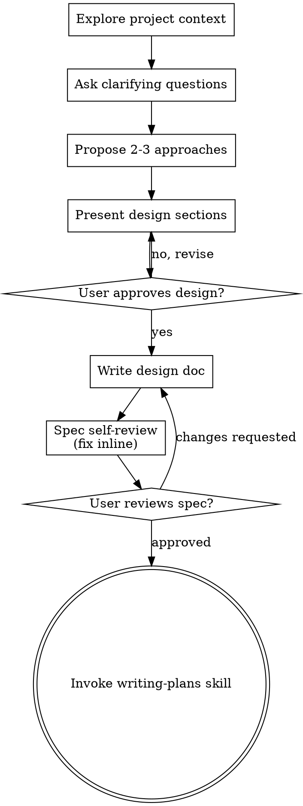
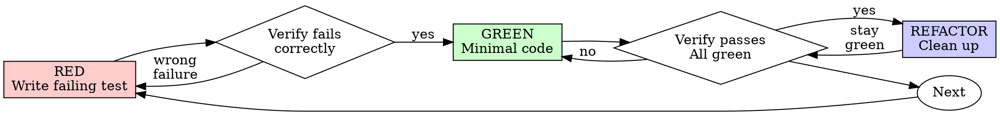

# Claude Code Session Transcript

Project B (AI-assisted) — URL Shortener.
Rendered from the raw session log at `session.jsonl`, which is the authoritative export.

Long tool outputs and thinking blocks are truncated for readability; nothing is
re-ordered or reworded. Collapsed sections expand.

---

### 👤 User

<local-command-caveat>Caveat: The messages below were generated by the user while running local commands. DO NOT respond to these messages or otherwise consider them in your response unless the user explicitly asks you to.</local-command-caveat>

### 👤 User

<command-name>/model</command-name>
            <command-message>model</command-message>
            <command-args></command-args>

### 👤 User

<local-command-stdout>Set model to Opus 4.8 and saved as your default for new sessions</local-command-stdout>

### 👤 User

Build a URL Shortener: a small application that takes long URLs, generates short codes, and redirects users. It also tracks how many times each short link has been clicked.
Backend (FastAPI + Python)

    An endpoint to create a short URL from a long URL
    A redirect endpoint that resolves the short code and redirects to the original URL
    A stats endpoint that returns the click count for a given short URL
    Simple authentication via API key for creating URLs (redirects are public)
    Persist data to SQLite
    Handle edge cases: duplicate URLs, invalid URLs, expired or missing short codes

Frontend (Next.js + React)

    A form to paste a long URL and get a short one
    A simple dashboard showing your created URLs and their click counts
    Proper loading and error states

Testing

Write a few meaningful tests for the backend.
Documentation

    API documentation
    Setup guide

AI Usage Requirements (mandatory)

    You MUST use AI coding tools for this project
    Export and include the full conversation transcript with your AI tool in a /prompts/ folder (e.g. Claude Code session log, Codex output, ChatGPT export, or copy-pasted session)
    State which AI model(s) you used and why you chose them

Planning Documents (Both Projects)

For both projects, include a /docs/ folder with your planning notes. We want to see how you thought before you coded: your understanding of the requirements, the approach you chose, any alternatives you considered, and any tradeoffs you identified. Format is up to you: markdown, diagrams, handwritten notes. Whatever reflects how you actually think. do that.

### 🤖 Claude

I'll start with the brainstorming skill since this is a build-from-scratch project.

**🔧 Skill** `superpowers:brainstorming`

<details><summary>📄 Result</summary>

```
Launching skill: superpowers:brainstorming
```
</details>

### 👤 User

Base directory for this skill: /home/joshua/.claude/plugins/cache/claude-plugins-official/superpowers/6.1.1/skills/brainstorming

# Brainstorming Ideas Into Designs

Help turn ideas into fully formed designs and specs through natural collaborative dialogue.

Start by understanding the current project context, then ask questions one at a time to refine the idea. Once you understand what you're building, present the design and get user approval.

<HARD-GATE>
Do NOT invoke any implementation skill, write any code, scaffold any project, or take any implementation action until you have presented a design and the user has approved it. This applies to EVERY project regardless of perceived simplicity.
</HARD-GATE>

## Anti-Pattern: "This Is Too Simple To Need A Design"

Every project goes through this process. A todo list, a single-function utility, a config change — all of them. "Simple" projects are where unexamined assumptions cause the most wasted work. The design can be short (a few sentences for truly simple projects), but you MUST present it and get approval.

## Checklist

You MUST create a task for each of these items and complete them in order:

1. **Explore project context** — check files, docs, recent commits
2. **Offer the visual companion just-in-time** — NOT upfront. The first time a question would genuinely be clearer shown than described, offer it then (its own message); on approval its browser tab opens for you. If no visual question ever arises, never offer it. See the Visual Companion section below.
3. **Ask clarifying questions** — one at a time, understand purpose/constraints/success criteria
4. **Propose 2-3 approaches** — with trade-offs and your recommendation
5. **Present design** — in sections scaled to their complexity, get user approval after each section
6. **Write design doc** — save to `docs/superpowers/specs/YYYY-MM-DD-<topic>-design.md` and commit
7. **Spec self-review** — quick inline check for placeholders, contradictions, ambiguity, scope (see below)
8. **User reviews written spec** — ask user to review the spec file before proceeding
9. **Transition to implementation** — invoke writing-plans skill to create implementation plan

## Process Flow



**The terminal state is invoking writing-plans.** Do NOT invoke frontend-design, mcp-builder, or any other implementation skill. The ONLY skill you invoke after brainstorming is writing-plans.

## The Process

**Understanding the idea:**

- Check out the current project state first (files, docs, recent commits)
- Before asking detailed questions, assess scope: if the request describes multiple independent subsystems (e.g., "build a platform with chat, file storage, billing, and analytics"), flag this immediately. Don't spend questions refining details of a project that needs to be decomposed first.
- If the project is too large for a single spec, help the user decompose into sub-projects: what are the independent pieces, how do they relate, what order should they be built? Then brainstorm the first sub-project through the normal design flow. Each sub-project gets its own spec → plan → implementation cycle.
- For appropriately-scoped projects, ask questions one at a time to refine the idea
- Prefer multiple choice questions when possible, but open-ended is fine too
- Only one question per message - if a topic needs more exploration, break it into multiple questions
- Focus on understanding: purpose, constraints, success criteria

**Exploring approaches:**

- Propose 2-3 different approaches with trade-offs
- Present options conversationally with your recommendation and reasoning
- Lead with your recommended option and explain why

**Presenting the design:**

- Once you believe you understand what you're building, present the design
- Scale each section to its complexity: a few sentences if straightforward, up to 200-300 words if nuanced
- Ask after each section whether it looks right so far
- Cover: architecture, components, data flow, error handling, testing
- Be ready to go back and clarify if something doesn't make sense

**Design for isolation and clarity:**

- Break the system into smaller units that each have one clear purpose, communicate through well-defined interfaces, and can be understood and tested independently
- For each unit, you should be able to answer: what does it do, how do you use it, and what does it depend on?
- Can someone understand what a unit does without reading its internals? Can you change the internals without breaking consumers? If not, the boundaries need work.
- Smaller, well-bounded units are also easier for you to work with - you reason better about code you can hold in context at once, and your edits are more reliable when files are focused. When a file grows large, that's often a signal that it's doing too much.

**Working in existing codebases:**

- Explore the current structure before proposing changes. Follow existing patterns.
- Where existing code has problems that affect the work (e.g., a file that's grown too large, unclear boundaries, tangled responsibilities), include targeted improvements as part of the design - the way a good developer improves code they're working in.
- Don't propose unrelated refactoring. Stay focused on what serves the current goal.

## After the Design

**Documentation:**

- Write the validated design (spec) to `docs/superpowers/specs/YYYY-MM-DD-<topic>-design.md`
  - (User preferences for spec location override this default)
- Use elements-of-style:writing-clearly-and-concisely skill if available
- Commit the design document to git

**Spec Self-Review:**
After writing the spec document, look at it with fresh eyes:

1. **Placeholder scan:** Any "TBD", "TODO", incomplete sections, or vague requirements? Fix them.
2. **Internal consistency:** Do any sections contradict each other? Does the architecture match the feature descriptions?
3. **Scope check:** Is this focused enough for a single implementation plan, or does it need decomposition?
4. **Ambiguity check:** Could any requirement be interpreted two different ways? If so, pick one and make it explicit.

Fix any issues inline. No need to re-review — just fix and move on.

**User Review Gate:**
After the spec review loop passes, ask the user to review the written spec before proceeding:

> "Spec written and committed to `<path>`. Please review it and let me know if you want to make any changes before we start writing out the implementation plan."

Wait for the user's response. If they request changes, make them and re-run the spec review loop. Only proceed once the user approves.

**Implementation:**

- Invoke the writing-plans skill to create a detailed implementation plan
- Do NOT invoke any other skill. writing-plans is the next step.

## Key Principles

- **One question at a time** - Don't overwhelm with multiple questions
- **Multiple choice preferred** - Easier to answer than open-ended when possible
- **YAGNI ruthlessly** - Remove unnecessary features from all designs
- **Explore alternatives** - Always propose 2-3 approaches before settling
- **Incremental validation** - Present design, get approval before moving on
- **Be flexible** - Go back and clarify when something doesn't make sense

## Visual Companion

A browser-based companion for showing mockups, diagrams, and visual options during brainstorming. Available as a tool — not a mode. Accepting the companion means it's available for questions that benefit from visual treatment; it does NOT mean every question goes through the browser.

**Offering the companion (just-in-time):** Do NOT offer it upfront. Wait until a question would genuinely be clearer shown than told — a real mockup / layout / diagram question, not merely a UI *topic*. The first time that happens, offer it then, as its own message:
> "This next part might be easier if I show you — I can put together mockups, diagrams, and comparisons in a browser tab as we go. It's still new and can be token-intensive. Want me to? I'll open it for you."

**This offer MUST be its own message.** Only the offer — no clarifying question, summary, or other content. Wait for the user's response. If they accept, start the server with `--open` so their browser opens to the first screen automatically. If they decline, continue text-only and don't offer again unless they raise it.

**Per-question decision:** Even after the user accepts, decide FOR EACH QUESTION whether to use the browser or the terminal. The test: **would the user understand this better by seeing it than reading it?**

- **Use the browser** for content that IS visual — mockups, wireframes, layout comparisons, architecture diagrams, side-by-side visual designs
- **Use the terminal** for content that is text — requirements questions, conceptual choices, tradeoff lists, A/B/C/D text options, scope decisions

A question about a UI topic is not automatically a visual question. "What does personality mean in this context?" is a conceptual question — use the terminal. "Which wizard layout works better?" is a visual question — use the browser.

If they agree to the companion, read the detailed guide before proceeding:
`skills/brainstorming/visual-companion.md`

**🔧 Bash** `ls -la /home/joshua/Desktop/Backend-Technical-Challenge/ /home/joshua/Desktop/Backend-Technical-Challenge/project-b-ai-a
… [170 more chars truncated]`
```bash
ls -la /home/joshua/Desktop/Backend-Technical-Challenge/ /home/joshua/Desktop/Backend-Technical-Challenge/project-b-ai-assisted/ 2>&1; echo "---NODE---"; node -v 2>&1; python3 --version 2>&1; echo "---GIT---"; cd /home/joshua/Desktop/Backend-Technical-Challenge && git log --oneline -5 2>&1
```

<details><summary>📄 Result</summary>

```
/home/joshua/Desktop/Backend-Technical-Challenge/:
total 28
drwxrwxr-x 6 joshua joshua 4096 Jul 17 15:08 .
drwxr-xr-x 8 joshua joshua 4096 Jul 17 15:38 ..
drwxrwxr-x 8 joshua joshua 4096 Jul 17 16:08 .git
drwxrwxr-x 6 joshua joshua 4096 Jul 16 23:48 project-a-manual
drwxrwxr-x 7 joshua joshua 4096 Jul 16 23:48 project-b-ai-assisted
-rw-rw-r-- 1 joshua joshua    9 Jul 16 23:46 README.MD
drwxrwxr-x 2 joshua joshua 4096 Jul 17 15:08 .vscode

/home/joshua/Desktop/Backend-Technical-Challenge/project-b-ai-assisted/:
total 28
drwxrwxr-x 7 joshua joshua 4096 Jul 16 23:48 .
drwxrwxr-x 6 joshua joshua 4096 Jul 17 15:08 ..
drwxrwxr-x 3 joshua joshua 4096 Jul 17 16:20 backend
drwxrwxr-x 2 joshua joshua 4096 Jul 16 23:48 docs
drwxrwxr-x 2 joshua joshua 4096 Jul 16 23:48 frontend
drwxrwxr-x 2 joshua joshua 4096 Jul 16 23:48 prompts
drwxrwxr-x 2 joshua joshua 4096 Jul 16 23:48 tests
---NODE---
v24.18.0
Python 3.12.3
---GIT---
f15b101 Done
c7802b0 Setup
cacfab5 add git
Shell cwd was reset to /home/joshua/Desktop/Backend-Technical-Challenge/project-b-ai-assisted
```
</details>

**🔧 Bash** `cd /home/joshua/Desktop/Backend-Technical-Challenge && find project-b-ai-assisted project-a-manual -not -path '*/node_mo
… [176 more chars truncated]`
```bash
cd /home/joshua/Desktop/Backend-Technical-Challenge && find project-b-ai-assisted project-a-manual -not -path '*/node_modules/*' -not -path '*/.git/*' -not -path '*/__pycache__/*' -not -path '*/.next/*' -not -path '*/venv/*' -not -path '*/.venv/*' | head -60; echo "=== README ==="; cat README.MD
```

<details><summary>📄 Result</summary>

```
project-b-ai-assisted
project-a-manual
project-b-ai-assisted/docs
project-b-ai-assisted/backend
project-b-ai-assisted/tests
project-b-ai-assisted/frontend
project-b-ai-assisted/prompts
project-a-manual/docs
project-a-manual/backend
project-a-manual/tests
project-a-manual/frontend
project-b-ai-assisted/backend/.python-version
project-b-ai-assisted/backend/venv
project-a-manual/docs/README.md
project-a-manual/backend/.python-version
project-a-manual/backend/__pycache__
project-a-manual/backend/crud.py
project-a-manual/backend/notes.db
project-a-manual/backend/database.py
project-a-manual/backend/schemas.py
project-a-manual/backend/venv
project-a-manual/backend/models.py
project-a-manual/backend/main.py
project-a-manual/frontend/tsconfig.json
project-a-manual/frontend/public
project-a-manual/frontend/.impeccable
project-a-manual/frontend/.gitignore
project-a-manual/frontend/node_modules
project-a-manual/frontend/eslint.config.mjs
project-a-manual/frontend/next-env.d.ts
project-a-manual/frontend/src
project-a-manual/frontend/types
project-a-manual/frontend/next.config.ts
project-a-manual/frontend/.next
project-a-manual/frontend/lib
project-a-manual/frontend/package-lock.json
project-a-
… [878 more chars truncated]
```
</details>

**🔧 Bash** `cd /home/joshua/Desktop/Backend-Technical-Challenge/project-a-manual && for f in backend/main.py backend/database.py bac
… [150 more chars truncated]`
```bash
cd /home/joshua/Desktop/Backend-Technical-Challenge/project-a-manual && for f in backend/main.py backend/database.py backend/models.py backend/schemas.py backend/crud.py frontend/lib/api.ts frontend/package.json; do echo "===== $f ====="; cat "$f"; done 2>&1 | head -220
```

<details><summary>📄 Result</summary>

```
===== backend/main.py =====
from fastapi import Depends, FastAPI, HTTPException
from fastapi.middleware.cors import CORSMiddleware
from sqlalchemy.orm import Session

import models, schemas, crud
from database import SessionLocal, engine, Base

Base.metadata.create_all(bind=engine)

app = FastAPI(title="Notes API")

app.add_middleware(
    CORSMiddleware,
    allow_origins=["http://localhost:3000"],
    allow_credentials=True,
    allow_methods=["*"],
    allow_headers=["*"],
)

def get_db():
    db = SessionLocal()
    try:
        yield db
    finally:
        db.close()


@app.get("/notes", response_model=list[schemas.NoteOut])
def read_notes(db: Session = Depends(get_db)):
    return crud.get_notes(db)

@app.get("/notes/{note_id}", response_model=schemas.NoteOut)
def read_note(note_id: int, db: Session = Depends(get_db)):
    db_note = crud.get_note(db, note_id)
    if not db_note:
        raise HTTPException(status_code=404, detail="Note not found")
    return db_note

@app.post("/notes", response_model=schemas.NoteOut, status_code=201)
def create_note(note: schemas.NoteCreate, db: Session = Depends(get_db)):
    return crud.create_note(db, note)

@app.put("/notes/{note_id}", 
… [4778 more chars truncated]
```
</details>

### 🤖 Claude

I've got the context — `project-a-manual` is a Notes app (FastAPI + SQLAlchemy + Next.js) that gives me a house style to follow, and `project-b-ai-assisted` is empty except for the folder skeleton (`backend/`, `frontend/`, `tests/`, `docs/`, `prompts/`) and a venv.

Before I design, one decision shapes the entire database schema:

**🔧 AskUserQuestion** ``

<details><summary>📄 Result</summary>

```
Your questions have been answered: "The dashboard shows "your created URLs" — but auth is a single API key. How should ownership work?"="Multi-key, keys own URLs (Recommended)" selected preview:
api_keys: id, key_hash, name, created_at
links:    id, code, long_url, api_key_id (FK), ...

GET /api/links  -> WHERE api_key_id = <caller>

Dashboard shows only links this key made., "If the same long URL is submitted twice by the same key, what should happen?"="Return the existing short code (Recommended)" selected preview:
POST /api/links {"url": "https://ex.com/a"}
-> 201 {"code": "aB3xK9"}

POST /api/links {"url": "https://ex.com/a"}
-> 200 {"code": "aB3xK9"}   # same code, "How should the frontend get an API key to talk to the backend?"="User pastes key, stored in localStorage (Recommended)" selected preview:
[ API key: ______________ ] [Save]

-> localStorage
-> fetch(..., {headers: {"X-API-Key": key}})

Switch keys -> dashboard re-scopes.. You can now continue with these answers in mind.
```
</details>

### 🤖 Claude

All three recommendations taken. Two more design choices, then I'll present the design:

**🔧 AskUserQuestion** ``

<details><summary>📄 Result</summary>

```
Your questions have been answered: "The spec mentions "expired" short codes as an edge case. How much expiry machinery do you want?"="Optional expires_at on create (Recommended)" selected preview:
POST /api/links
{"url": "...", "expires_in_days": 7}

GET /aB3xK9  (after 7 days)
-> 410 Gone

GET /nope123
-> 404 Not Found, "How deep should click tracking go?"="Counter column only (Recommended)" selected preview:
links.click_count INTEGER

UPDATE links
   SET click_count = click_count + 1
 WHERE id = ?

GET /api/links/{code}/stats
-> {"click_count": 42}. You can now continue with these answers in mind.
```
</details>

### 🤖 Claude

Here's the design. Everything below reflects the choices you just made.

## Architecture

Two processes, same shape as `project-a-manual` so the two projects read as one codebase: FastAPI on `:8000` owning SQLite, Next.js on `:3000` talking to it over `fetch`. The backend splits by responsibility rather than piling into `main.py` — `main.py` (routes only), `database.py`, `models.py`, `schemas.py`, `crud.py`, plus `auth.py` (the API-key dependency) and `shortcode.py` (code generation). Each is small enough to hold in your head, and `crud.py` never imports FastAPI so the data layer stays testable without HTTP.

## Data model

```
api_keys:  id, key_hash, name, created_at
links:     id, code (unique, indexed), long_url, api_key_id (FK),
           click_count, created_at, expires_at (nullable)
```

Keys are stored as SHA-256 hashes, never plaintext — the seed script prints the raw key once and it's unrecoverable after. That's the same reason you don't store passwords in the clear, and it costs one line.

## Short code generation

6 characters of base62 drawn from `secrets`, with a unique constraint on `code` and a retry loop on collision. I considered base62-encoding the row id (shorter codes, zero collisions — but every link is trivially enumerable, so anyone can scrape the whole database by counting) and hashing the URL (dedup falls out for free — but truncating a hash reintroduces collisions with none of the randomness benefits). Random-plus-retry is the one that isn't guessable, and at 62^6 ≈ 57 billion the retry branch is nearly unreachable — so a test forces it directly rather than hoping.

## The redirect

`GET /{code}` returns **307**, not 301. A 301 is cached by the browser permanently, which means the second click never reaches the server and the click counter silently stops moving — the feature quietly breaks in exactly the way that looks like it works. 307 plus `Cache-Control: no-store` keeps every click observable. The increment is an atomic `UPDATE ... SET click_count = click_count + 1` in SQL, not a read-then-write in Python, so concurrent clicks can't lose each other.

## API surface

| Method | Path | Auth | Behavior |
|---|---|---|---|
| POST | `/api/links` | yes | 201 new, **200** if this key already shortened that URL |
| GET | `/api/links` | yes | links owned by the calling key |
| GET | `/api/links/{code}/stats` | yes | owner-scoped click count |
| GET | `/{code}` | no | 307 redirect, or 404 / 410 |

Errors: 401 missing or invalid key, 422 invalid URL, 404 unknown code, 410 expired. **404 vs 410 is the distinction that matters** — "this link never existed" and "this link died" are different facts, and collapsing them into 404 throws away the only thing the user actually needs to know.

URL validation rejects anything outside `http`/`https`. Pydantic's `HttpUrl` alone would happily accept `javascript:alert(1)` — and since we hand that string to a browser redirect, an unvalidated scheme is a stored-XSS vector, not a tidiness issue.

## Frontend

One page: a key field (localStorage), a shorten form, and a dashboard table (code, destination, clicks, created, expires, copy button). Each async surface gets all four states — loading, error, empty, populated — including the empty dashboard, which is the state a reviewer sees *first* and the one most likely to be skipped.

## Tests

pytest + `TestClient`, against a temp SQLite file via dependency override, so tests never touch the dev database. Meaningful over numerous — each targets a way this could actually break:

- create without a key → 401; with a garbage key → 401
- create → redirect 307 lands on the original URL
- same URL twice → same code, 200 not 201
- `javascript:` scheme → 422
- unknown code → 404; expired code → 410
- three redirects → stats reports exactly 3
- **key B cannot see or stat key A's links** (the one that fails silently in real apps)
- forced collision → retry mints a distinct code

Plus `/docs/` planning notes, `/prompts/` transcript, API docs, and a setup guide.

Does this look right? Flag anything you want changed and I'll fold it in — otherwise I'll write the spec to `docs/` and move to the implementation plan.

### 👤 User

yes it looks right.

### 🤖 Claude

Design approved. Writing the spec now — and since the challenge itself asks for `/docs/` planning notes showing how I thought before coding, the spec lands there directly rather than in a nested `superpowers/specs/` path. It's the same document serving both purposes.

**🔧 TaskCreate** ``

<details><summary>📄 Result</summary>

```
<tool_use_error>InputValidationError: TaskCreate failed due to the following issues:
The required parameter `subject` is missing
The required parameter `description` is missing
An unexpected parameter `tasks` was provided

TaskCreate creates ONE task per call and has no `tasks` or `todos` parameter. Call TaskCreate once per task, passing `subject` (a brief title) and `description` (what needs to be done) as top-level string parameters.

This tool's schema was not sent to the API — it was not in the discovered-tool set derived from message history. Without the schema in your prompt, typed parameters (arrays, numbers, booleans) get emitted as strings and the client-side parser rejects them. Load the tool first: call ToolSearch with query "select:TaskCreate", then retry this call. For reference, this tool's input schema is: {"$schema":"https://json-schema.org/draft/2020-12/schema","type":"object","properties":{"subject":{"description":"A brief title for the task","type":"string"},"description":{"description":"What needs to be done","type":"string"},"activeForm":{"description":"Present continuous form shown in spinner when in_progress (e.g., \"Running tests\")","type":"string"},"metada
… [223 more chars truncated]
```
</details>

### 🤖 Claude

Task tool wants one call per task; not worth four round-trips for a four-item list I'm about to burn down. Writing the spec.

**🔧 Write** `/home/joshua/Desktop/Backend-Technical-Challenge/project-b-ai-assisted/docs/2026-07-17-url-shortener-design.md`
```
# URL Shortener — Design

**Date:** 2026-07-17
**Status:** Approved, pending implementation plan

This is the thinking that happened before the code. It records what I understood the
requirements to be, the approach I chose, the alternatives I rejected and why, and the
tradeoffs I'm knowingly accepting.

---

## 1. Understanding the requirements

The literal asks, and what each one actually implies:

| Requirement | What it implies beyond the literal reading |
|---|---|
| Create a short URL from a long URL | Needs auth, URL validation, and a collision-safe code generator |
| Redirect endpoint resolves code → original | Must be public, and must stay *observable* so clicks can be counted |
| Stats endpoint returns click count | Counting has to survive concurrent clicks |
| API key auth for creating; redirects public | Two distinct trust zones in one app |
| Persist to SQLite | Single-write
… [11758 more chars truncated]
```

<details><summary>📄 Result</summary>

```
File created successfully at: /home/joshua/Desktop/Backend-Technical-Challenge/project-b-ai-assisted/docs/2026-07-17-url-shortener-design.md (file state is current in your context — no need to Read it back)
```
</details>

### 🤖 Claude

Now the spec self-review — checking for placeholders, contradictions, and ambiguity. One inaccuracy found: I claimed hashing makes the key comparison constant-time, which conflates two unrelated things.

**🔧 Edit** `/home/joshua/Desktop/Backend-Technical-Challenge/project-b-ai-assisted/docs/2026-07-17-url-shortener-design.md`

<details><summary>📄 Result</summary>

```
The file /home/joshua/Desktop/Backend-Technical-Challenge/project-b-ai-assisted/docs/2026-07-17-url-shortener-design.md has been updated successfully. (file state is current in your context — no need to Read it back)
```
</details>

### 🤖 Claude

One ambiguity left: the request takes `expires_in_days` but the schema stores `expires_at`, and I never said so explicitly.

**🔧 Edit** `/home/joshua/Desktop/Backend-Technical-Challenge/project-b-ai-assisted/docs/2026-07-17-url-shortener-design.md`

<details><summary>📄 Result</summary>

```
The file /home/joshua/Desktop/Backend-Technical-Challenge/project-b-ai-assisted/docs/2026-07-17-url-shortener-design.md has been updated successfully. (file state is current in your context — no need to Read it back)
```
</details>

### 🤖 Claude

Committing the spec.

**🔧 Bash** `cd /home/joshua/Desktop/Backend-Technical-Challenge && git add project-b-ai-assisted/docs/2026-07-17-url-shortener-desig
… [688 more chars truncated]`
```bash
cd /home/joshua/Desktop/Backend-Technical-Challenge && git add project-b-ai-assisted/docs/2026-07-17-url-shortener-design.md && git commit -q -F - <<'EOF' && git log --oneline -1
Add URL shortener design doc

Records the pre-implementation thinking: requirements analysis, chosen
approach, rejected alternatives, and known tradeoffs.

Key decisions:
- API keys own links (dashboard's "your URLs" requires authorization,
  not just authentication)
- 307 not 301 redirects (301 is browser-cached, silently stops click
  counting)
- Random base62 + retry, not id-encoding (id-encoded codes are
  enumerable)
- http/https scheme allowlist (HttpUrl alone accepts javascript:,
  which is stored XSS via the redirect)
- 410 for expired vs 404 for missing

Co-Authored-By: Claude Opus 4.8 <noreply@anthropic.com>
EOF
```

<details><summary>📄 Result</summary>

```
a8db194 Add URL shortener design doc
Shell cwd was reset to /home/joshua/Desktop/Backend-Technical-Challenge/project-b-ai-assisted
```
</details>

### 🤖 Claude

Spec written and committed to `project-b-ai-assisted/docs/2026-07-17-url-shortener-design.md` (commit `a8db194`).

It follows the design you approved, with two things I fixed during self-review that are worth flagging since they changed content rather than wording:

- **I had claimed hashing makes the API-key comparison constant-time.** That's wrong — it conflates two different things. The index lookup still compares bytes; what actually defuses a timing attack is that an attacker can't steer the compared value without inverting SHA-256. The doc now says that instead of the false version.
- **The expiry field was ambiguous** — I'd written `expires_in_days` in one section and `expires_at` in the schema without ever saying how they relate. Now explicit: relative TTL in, absolute timestamp out and stored.

The doc also carries a section the challenge didn't ask for but that I think earns its place: a collected list of known tradeoffs (no rate limiting, no per-click event rows, localStorage keys, SQLite's single writer). Those are decisions I made rather than things I missed, and writing them down is the difference between the two.

Please review it and let me know if you want changes before I write the implementation plan.

### 👤 User

its good, now implement it.

### 🤖 Claude

Spec approved. You've said implement, so I'll skip the separate planning step — the spec is detailed enough to act as the plan. TDD applies here though, so let me load it first.

**🔧 Skill** `superpowers:test-driven-development`

<details><summary>📄 Result</summary>

```
Launching skill: superpowers:test-driven-development
```
</details>

### 👤 User

Base directory for this skill: /home/joshua/.claude/plugins/cache/claude-plugins-official/superpowers/6.1.1/skills/test-driven-development

# Test-Driven Development (TDD)

## Overview

Write the test first. Watch it fail. Write minimal code to pass.

**Core principle:** If you didn't watch the test fail, you don't know if it tests the right thing.

**Violating the letter of the rules is violating the spirit of the rules.**

## When to Use

**Always:**
- New features
- Bug fixes
- Refactoring
- Behavior changes

**Exceptions (ask your human partner):**
- Throwaway prototypes
- Generated code
- Configuration files

Thinking "skip TDD just this once"? Stop. That's rationalization.

## The Iron Law

```
NO PRODUCTION CODE WITHOUT A FAILING TEST FIRST
```

Write code before the test? Delete it. Start over.

**No exceptions:**
- Don't keep it as "reference"
- Don't "adapt" it while writing tests
- Don't look at it
- Delete means delete

Implement fresh from tests. Period.

## Red-Green-Refactor



### RED - Write Failing Test

Write one minimal test showing what should happen.

<Good>
```typescript
test('retries failed operations 3 times', async () => {
  let attempts = 0;
  const operation = () => {
    attempts++;
    if (attempts < 3) throw new Error('fail');
    return 'success';
  };

  const result = await retryOperation(operation);

  expect(result).toBe('success');
  expect(attempts).toBe(3);
});
```
Clear name, tests real behavior, one thing
</Good>

<Bad>
```typescript
test('retry works', async () => {
  const mock = jest.fn()
    .mockRejectedValueOnce(new Error())
    .mockRejectedValueOnce(new Error())
    .mockResolvedValueOnce('success');
  await retryOperation(mock);
  expect(mock).toHaveBeenCalledTimes(3);
});
```
Vague name, tests mock not code
</Bad>

**Requirements:**
- One behavior
- Clear name
- Real code (no mocks unless unavoidable)

### Verify RED - Watch It Fail

**MANDATORY. Never skip.**

```bash
npm test path/to/test.test.ts
```

Confirm:
- Test fails (not errors)
- Failure message is expected
- Fails because feature missing (not typos)

**Test passes?** You're testing existing behavior. Fix test.

**Test errors?** Fix error, re-run until it fails correctly.

### GREEN - Minimal Code

Write simplest code to pass the test.

<Good>
```typescript
async function retryOperation<T>(fn: () => Promise<T>): Promise<T> {
  for (let i = 0; i < 3; i++) {
    try {
      return await fn();
    } catch (e) {
      if (i === 2) throw e;
    }
  }
  throw new Error('unreachable');
}
```
Just enough to pass
</Good>

<Bad>
```typescript
async function retryOperation<T>(
  fn: () => Promise<T>,
  options?: {
    maxRetries?: number;
    backoff?: 'linear' | 'exponential';
    onRetry?: (attempt: number) => void;
  }
): Promise<T> {
  // YAGNI
}
```
Over-engineered
</Bad>

Don't add features, refactor other code, or "improve" beyond the test.

### Verify GREEN - Watch It Pass

**MANDATORY.**

```bash
npm test path/to/test.test.ts
```

Confirm:
- Test passes
- Other tests still pass
- Output pristine (no errors, warnings)

**Test fails?** Fix code, not test.

**Other tests fail?** Fix now.

### REFACTOR - Clean Up

After green only:
- Remove duplication
- Improve names
- Extract helpers

Keep tests green. Don't add behavior.

### Repeat

Next failing test for next feature.

## Good Tests

| Quality | Good | Bad |
|---------|------|-----|
| **Minimal** | One thing. "and" in name? Split it. | `test('validates email and domain and whitespace')` |
| **Clear** | Name describes behavior | `test('test1')` |
| **Shows intent** | Demonstrates desired API | Obscures what code should do |

## Why Order Matters

**"I'll write tests after to verify it works"**

Tests written after code pass immediately. Passing immediately proves nothing:
- Might test wrong thing
- Might test implementation, not behavior
- Might miss edge cases you forgot
- You never saw it catch the bug

Test-first forces you to see the test fail, proving it actually tests something.

**"I already manually tested all the edge cases"**

Manual testing is ad-hoc. You think you tested everything but:
- No record of what you tested
- Can't re-run when code changes
- Easy to forget cases under pressure
- "It worked when I tried it" ≠ comprehensive

Automated tests are systematic. They run the same way every time.

**"Deleting X hours of work is wasteful"**

Sunk cost fallacy. The time is already gone. Your choice now:
- Delete and rewrite with TDD (X more hours, high confidence)
- Keep it and add tests after (30 min, low confidence, likely bugs)

The "waste" is keeping code you can't trust. Working code without real tests is technical debt.

**"TDD is dogmatic, being pragmatic means adapting"**

TDD IS pragmatic:
- Finds bugs before commit (faster than debugging after)
- Prevents regressions (tests catch breaks immediately)
- Documents behavior (tests show how to use code)
- Enables refactoring (change freely, tests catch breaks)

"Pragmatic" shortcuts = debugging in production = slower.

**"Tests after achieve the same goals - it's spirit not ritual"**

No. Tests-after answer "What does this do?" Tests-first answer "What should this do?"

Tests-after are biased by your implementation. You test what you built, not what's required. You verify remembered edge cases, not discovered ones.

Tests-first force edge case discovery before implementing. Tests-after verify you remembered everything (you didn't).

30 minutes of tests after ≠ TDD. You get coverage, lose proof tests work.

## Common Rationalizations

| Excuse | Reality |
|--------|---------|
| "Too simple to test" | Simple code breaks. Test takes 30 seconds. |
| "I'll test after" | Tests passing immediately prove nothing. |
| "Tests after achieve same goals" | Tests-after = "what does this do?" Tests-first = "what should this do?" |
| "Already manually tested" | Ad-hoc ≠ systematic. No record, can't re-run. |
| "Deleting X hours is wasteful" | Sunk cost fallacy. Keeping unverified code is technical debt. |
| "Keep as reference, write tests first" | You'll adapt it. That's testing after. Delete means delete. |
| "Need to explore first" | Fine. Throw away exploration, start with TDD. |
| "Test hard = design unclear" | Listen to test. Hard to test = hard to use. |
| "TDD will slow me down" | TDD faster than debugging. Pragmatic = test-first. |
| "Manual test faster" | Manual doesn't prove edge cases. You'll re-test every change. |
| "Existing code has no tests" | You're improving it. Add tests for existing code. |

## Red Flags - STOP and Start Over

- Code before test
- Test after implementation
- Test passes immediately
- Can't explain why test failed
- Tests added "later"
- Rationalizing "just this once"
- "I already manually tested it"
- "Tests after achieve the same purpose"
- "It's about spirit not ritual"
- "Keep as reference" or "adapt existing code"
- "Already spent X hours, deleting is wasteful"
- "TDD is dogmatic, I'm being pragmatic"
- "This is different because..."

**All of these mean: Delete code. Start over with TDD.**

## Example: Bug Fix

**Bug:** Empty email accepted

**RED**
```typescript
test('rejects empty email', async () => {
  const result = await submitForm({ email: '' });
  expect(result.error).toBe('Email required');
});
```

**Verify RED**
```bash
$ npm test
FAIL: expected 'Email required', got undefined
```

**GREEN**
```typescript
function submitForm(data: FormData) {
  if (!data.email?.trim()) {
    return { error: 'Email required' };
  }
  // ...
}
```

**Verify GREEN**
```bash
$ npm test
PASS
```

**REFACTOR**
Extract validation for multiple fields if needed.

## Verification Checklist

Before marking work complete:

- [ ] Every new function/method has a test
- [ ] Watched each test fail before implementing
- [ ] Each test failed for expected reason (feature missing, not typo)
- [ ] Wrote minimal code to pass each test
- [ ] All tests pass
- [ ] Output pristine (no errors, warnings)
- [ ] Tests use real code (mocks only if unavoidable)
- [ ] Edge cases and errors covered

Can't check all boxes? You skipped TDD. Start over.

## When Stuck

| Problem | Solution |
|---------|----------|
| Don't know how to test | Write wished-for API. Write assertion first. Ask your human partner. |
| Test too complicated | Design too complicated. Simplify interface. |
| Must mock everything | Code too coupled. Use dependency injection. |
| Test setup huge | Extract helpers. Still complex? Simplify design. |

## Debugging Integration

Bug found? Write failing test reproducing it. Follow TDD cycle. Test proves fix and prevents regression.

Never fix bugs without a test.

## Testing Anti-Patterns

When adding mocks or test utilities, read [testing-anti-patterns.md](testing-anti-patterns.md) to avoid common pitfalls:
- Testing mock behavior instead of real behavior
- Adding test-only methods to production classes
- Mocking without understanding dependencies

## Final Rule

```
Production code → test exists and failed first
Otherwise → not TDD
```

No exceptions without your human partner's permission.

**🔧 Bash** `cd /home/joshua/Desktop/Backend-Technical-Challenge/project-b-ai-assisted/backend && ls -a && cat .python-version 2>&1 &
… [25 more chars truncated]`
```bash
cd /home/joshua/Desktop/Backend-Technical-Challenge/project-b-ai-assisted/backend && ls -a && cat .python-version 2>&1 && ls venv/bin 2>&1 | head
```

<details><summary>📄 Result</summary>

```
.
..
.python-version
venv
3.14-dev
activate
activate.csh
activate.fish
Activate.ps1
pip
pip3
pip3.14
python
python3
python3.14
```
</details>

### 🤖 Claude

Venv exists on Python 3.14. Installing dependencies.

**🔧 Bash** `./venv/bin/pip install -q --upgrade pip 2>&1 | tail -2; ./venv/bin/pip install -q fastapi 'uvicorn[standard]' sqlalchemy
… [337 more chars truncated]`
```bash
./venv/bin/pip install -q --upgrade pip 2>&1 | tail -2; ./venv/bin/pip install -q fastapi 'uvicorn[standard]' sqlalchemy pydantic 'pytest' httpx 2>&1 | tail -5; echo "=== versions ==="; ./venv/bin/python -c "import fastapi, sqlalchemy, pydantic, pytest, httpx; print('fastapi', fastapi.__version__); print('sqlalchemy', sqlalchemy.__version__); print('pydantic', pydantic.__version__); print('pytest', pytest.__version__); print('httpx', httpx.__version__)"
```

<details><summary>📄 Result</summary>

```
=== versions ===
fastapi 0.139.2
sqlalchemy 2.0.51
pydantic 2.13.4
pytest 9.1.1
httpx 0.28.1
```
</details>

### 🤖 Claude

Dependencies in. Starting the TDD cycle with `shortcode.py` — it's pure, so it needs no database scaffolding. Test first:

**🔧 Write** `/home/joshua/Desktop/Backend-Technical-Challenge/project-b-ai-assisted/pytest.ini`
```
[pytest]
pythonpath = backend
testpaths = tests

```

<details><summary>📄 Result</summary>

```
File created successfully at: /home/joshua/Desktop/Backend-Technical-Challenge/project-b-ai-assisted/pytest.ini (file state is current in your context — no need to Read it back)
```
</details>

**🔧 Write** `/home/joshua/Desktop/Backend-Technical-Challenge/project-b-ai-assisted/tests/test_shortcode.py`
```
import re

import shortcode


def test_generates_code_of_configured_length():
    assert len(shortcode.generate(length=6)) == 6


def test_generates_only_base62_characters():
    code = shortcode.generate(length=6)
    assert re.fullmatch(r"[0-9A-Za-z]{6}", code)


def test_generates_different_codes_on_successive_calls():
    codes = {shortcode.generate(length=6) for _ in range(100)}
    # 62^6 keyspace; 100 draws colliding would mean the source isn't random.
    assert len(codes) == 100

```

<details><summary>📄 Result</summary>

```
File created successfully at: /home/joshua/Desktop/Backend-Technical-Challenge/project-b-ai-assisted/tests/test_shortcode.py (file state is current in your context — no need to Read it back)
```
</details>

**🔧 Bash** `cd /home/joshua/Desktop/Backend-Technical-Challenge/project-b-ai-assisted && ./backend/venv/bin/python -m pytest tests/t
… [32 more chars truncated]`
```bash
cd /home/joshua/Desktop/Backend-Technical-Challenge/project-b-ai-assisted && ./backend/venv/bin/python -m pytest tests/test_shortcode.py 2>&1 | tail -15
```

<details><summary>📄 Result</summary>

```
==================================== ERRORS ====================================
___________________ ERROR collecting tests/test_shortcode.py ___________________
ImportError while importing test module '/home/joshua/Desktop/Backend-Technical-Challenge/project-b-ai-assisted/tests/test_shortcode.py'.
Hint: make sure your test modules/packages have valid Python names.
Traceback:
../../../.pyenv/versions/3.14-dev/lib/python3.14/importlib/__init__.py:88: in import_module
    return _bootstrap._gcd_import(name[level:], package, level)
           ^^^^^^^^^^^^^^^^^^^^^^^^^^^^^^^^^^^^^^^^^^^^^^^^^^^^
tests/test_shortcode.py:3: in <module>
    import shortcode
E   ModuleNotFoundError: No module named 'shortcode'
=========================== short test summary info ============================
ERROR tests/test_shortcode.py
!!!!!!!!!!!!!!!!!!!! Interrupted: 1 error during collection !!!!!!!!!!!!!!!!!!!!
=============================== 1 error in 0.28s =======
… [28 more chars truncated]
```
</details>

### 🤖 Claude

Fails correctly — module missing, and `pythonpath` is resolving. GREEN:

**🔧 Write** `/home/joshua/Desktop/Backend-Technical-Challenge/project-b-ai-assisted/backend/shortcode.py`
```
"""Short code generation.

Pure and dependency-free so it can be tested without a database.
"""

import secrets
import string

ALPHABET = string.digits + string.ascii_letters  # base62


def generate(length: int) -> str:
    """Return a random base62 code.

    Drawn from `secrets`, not `random`: codes are the only thing standing
    between a private link and anyone who guesses it, so the generator must
    not be seedable or predictable from prior outputs.
    """
    return "".join(secrets.choice(ALPHABET) for _ in range(length))

```

<details><summary>📄 Result</summary>

```
File created successfully at: /home/joshua/Desktop/Backend-Technical-Challenge/project-b-ai-assisted/backend/shortcode.py (file state is current in your context — no need to Read it back)
```
</details>

**🔧 Bash** `./backend/venv/bin/python -m pytest tests/test_shortcode.py 2>&1 | tail -5`
```bash
./backend/venv/bin/python -m pytest tests/test_shortcode.py 2>&1 | tail -5
```

<details><summary>📄 Result</summary>

```
collected 3 items

tests/test_shortcode.py ...                                              [100%]

============================== 3 passed in 0.03s ===============================
```
</details>

### 🤖 Claude

`shortcode` green. Next cycle: URL validation — the `javascript:` scheme rejection from §7 of the spec. Test first:

**🔧 Write** `/home/joshua/Desktop/Backend-Technical-Challenge/project-b-ai-assisted/tests/test_schemas.py`
```
import pytest
from pydantic import ValidationError

import schemas


def test_accepts_a_plain_https_url():
    assert schemas.LinkCreate(url="https://example.com/a").url == "https://example.com/a"


def test_accepts_http_as_well_as_https():
    assert schemas.LinkCreate(url="http://example.com").url == "http://example.com"


@pytest.mark.parametrize(
    "hostile_url",
    [
        "javascript:alert(document.cookie)",
        "data:text/html,<script>alert(1)</script>",
        "file:///etc/passwd",
    ],
)
def test_rejects_non_http_schemes(hostile_url):
    """These are syntactically valid URLs but unsafe redirect destinations.

    We hand long_url straight to a browser, so a javascript: or data: target
    makes every click execute attacker script -- stored XSS, not untidiness.
    """
    with pytest.raises(ValidationError):
        schemas.LinkCreate(url=hostile_url)


def test_rej
… [579 more chars truncated]
```

<details><summary>📄 Result</summary>

```
File created successfully at: /home/joshua/Desktop/Backend-Technical-Challenge/project-b-ai-assisted/tests/test_schemas.py (file state is current in your context — no need to Read it back)
```
</details>

**🔧 Bash** `./backend/venv/bin/python -m pytest tests/test_schemas.py 2>&1 | tail -6`
```bash
./backend/venv/bin/python -m pytest tests/test_schemas.py 2>&1 | tail -6
```

<details><summary>📄 Result</summary>

```
    import schemas
E   ModuleNotFoundError: No module named 'schemas'
=========================== short test summary info ============================
ERROR tests/test_schemas.py
!!!!!!!!!!!!!!!!!!!! Interrupted: 1 error during collection !!!!!!!!!!!!!!!!!!!!
=============================== 1 error in 0.32s ===============================
```
</details>

### 🤖 Claude

Fails for the right reason. GREEN — writing `config.py` and `schemas.py`:

**🔧 Write** `/home/joshua/Desktop/Backend-Technical-Challenge/project-b-ai-assisted/backend/config.py`
```
"""Settings, read from the environment with sane local defaults."""

import os

# Where SQLite lives. Overridden in tests so they never touch the dev database.
DATABASE_URL = os.getenv("DATABASE_URL", "sqlite:///./shortener.db")

# Length of generated short codes. 62^6 ~= 57 billion.
CODE_LENGTH = int(os.getenv("CODE_LENGTH", "6"))

# How many times to retry when a generated code collides with an existing one.
CODE_MAX_ATTEMPTS = int(os.getenv("CODE_MAX_ATTEMPTS", "5"))

# Public origin of this API, used to build the full short URL in responses.
BASE_URL = os.getenv("BASE_URL", "http://localhost:8000").rstrip("/")

# Origin allowed to call the API from a browser.
FRONTEND_ORIGIN = os.getenv("FRONTEND_ORIGIN", "http://localhost:3000")

MAX_URL_LENGTH = 2048

```

<details><summary>📄 Result</summary>

```
File created successfully at: /home/joshua/Desktop/Backend-Technical-Challenge/project-b-ai-assisted/backend/config.py (file state is current in your context — no need to Read it back)
```
</details>

**🔧 Write** `/home/joshua/Desktop/Backend-Technical-Challenge/project-b-ai-assisted/backend/schemas.py`
```
"""Request and response models.

The URL validator here is a security boundary, not a formatting nicety --
see `validate_url`.
"""

from datetime import datetime
from typing import Annotated, Optional

from pydantic import BaseModel, ConfigDict, Field, TypeAdapter, field_validator
from pydantic import HttpUrl

import config

# HttpUrl gives us syntax checking. It is deliberately paired with the scheme
# allowlist below -- on its own it is not enough.
_http_url = TypeAdapter(HttpUrl)


class LinkCreate(BaseModel):
    url: str
    expires_in_days: Optional[Annotated[int, Field(ge=1, le=3650)]] = None

    @field_validator("url")
    @classmethod
    def validate_url(cls, v: str) -> str:
        """Reject anything we would not be willing to redirect a browser to.

        `javascript:alert(1)` and `data:text/html,...` are perfectly valid
        URLs. Since the redirect hands this string t
… [1119 more chars truncated]
```

<details><summary>📄 Result</summary>

```
File created successfully at: /home/joshua/Desktop/Backend-Technical-Challenge/project-b-ai-assisted/backend/schemas.py (file state is current in your context — no need to Read it back)
```
</details>

**🔧 Bash** `./backend/venv/bin/python -m pytest tests/test_schemas.py 2>&1 | tail -12`
```bash
./backend/venv/bin/python -m pytest tests/test_schemas.py 2>&1 | tail -12
```

<details><summary>📄 Result</summary>

```
============================= test session starts ==============================
platform linux -- Python 3.14.6+, pytest-9.1.1, pluggy-1.6.0
rootdir: /home/joshua/Desktop/Backend-Technical-Challenge/project-b-ai-assisted
configfile: pytest.ini
plugins: anyio-4.14.2
collected 9 items

tests/test_schemas.py .........                                          [100%]

============================== 9 passed in 0.19s ===============================
```
</details>

### 🤖 Claude

9 passing. Now the API layer. Writing the test fixtures plus the auth tests — the 401 boundary first:

**🔧 Write** `/home/joshua/Desktop/Backend-Technical-Challenge/project-b-ai-assisted/tests/conftest.py`
```
"""Shared test fixtures.

Every test runs against a throwaway SQLite file in a tmp_path, wired in via
FastAPI's dependency_overrides. Tests must never touch the dev database -- a
suite that wipes real data gets run once and then never trusted again.
"""

import pytest
from fastapi.testclient import TestClient
from sqlalchemy import create_engine
from sqlalchemy.orm import sessionmaker

import crud
import main
from database import Base, get_db


@pytest.fixture
def db_session(tmp_path):
    engine = create_engine(
        f"sqlite:///{tmp_path}/test.db",
        connect_args={"check_same_thread": False},
    )
    Base.metadata.create_all(bind=engine)
    TestingSession = sessionmaker(autocommit=False, autoflush=False, bind=engine)
    session = TestingSession()
    try:
        yield session
    finally:
        session.close()
        engine.dispose()


@pytest.fixture
def client(db_ses
… [729 more chars truncated]
```

<details><summary>📄 Result</summary>

```
File created successfully at: /home/joshua/Desktop/Backend-Technical-Challenge/project-b-ai-assisted/tests/conftest.py (file state is current in your context — no need to Read it back)
```
</details>

**🔧 Write** `/home/joshua/Desktop/Backend-Technical-Challenge/project-b-ai-assisted/tests/test_auth.py`
```
"""The authentication boundary: creating links needs a key, redirects do not."""

PROTECTED = [
    ("post", "/api/links"),
    ("get", "/api/links"),
    ("get", "/api/links/abc123/stats"),
]


def test_create_without_a_key_is_rejected(client):
    r = client.post("/api/links", json={"url": "https://example.com"})
    assert r.status_code == 401


def test_create_with_an_unknown_key_is_rejected(client):
    r = client.post(
        "/api/links",
        json={"url": "https://example.com"},
        headers={"X-API-Key": "totally-made-up"},
    )
    assert r.status_code == 401


def test_every_management_endpoint_requires_a_key(client):
    for method, path in PROTECTED:
        r = getattr(client, method)(path, json={"url": "https://example.com"})
        assert r.status_code == 401, f"{method.upper()} {path} was not protected"


def test_missing_and_invalid_keys_are_indistinguishable(c
… [832 more chars truncated]
```

<details><summary>📄 Result</summary>

```
File created successfully at: /home/joshua/Desktop/Backend-Technical-Challenge/project-b-ai-assisted/tests/test_auth.py (file state is current in your context — no need to Read it back)
```
</details>

**🔧 Bash** `./backend/venv/bin/python -m pytest tests/test_auth.py 2>&1 | tail -6`
```bash
./backend/venv/bin/python -m pytest tests/test_auth.py 2>&1 | tail -6
```

<details><summary>📄 Result</summary>

```
ImportError while loading conftest '/home/joshua/Desktop/Backend-Technical-Challenge/project-b-ai-assisted/tests/conftest.py'.
tests/conftest.py:13: in <module>
    import crud
E   ModuleNotFoundError: No module named 'crud'
```
</details>

### 🤖 Claude

RED confirmed. Now GREEN — the database layer, models, crud, auth, and routes:

**🔧 Write** `/home/joshua/Desktop/Backend-Technical-Challenge/project-b-ai-assisted/backend/database.py`
```
from sqlalchemy import create_engine
from sqlalchemy.orm import declarative_base, sessionmaker

import config

engine = create_engine(
    config.DATABASE_URL,
    connect_args={"check_same_thread": False},
)
SessionLocal = sessionmaker(autocommit=False, autoflush=False, bind=engine)
Base = declarative_base()


def get_db():
    """Request-scoped session.

    Lives here rather than in main.py so tests can override it by importing
    from the same place the routes do.
    """
    db = SessionLocal()
    try:
        yield db
    finally:
        db.close()

```

<details><summary>📄 Result</summary>

```
File created successfully at: /home/joshua/Desktop/Backend-Technical-Challenge/project-b-ai-assisted/backend/database.py (file state is current in your context — no need to Read it back)
```
</details>

**🔧 Write** `/home/joshua/Desktop/Backend-Technical-Challenge/project-b-ai-assisted/backend/models.py`
```
from datetime import datetime, timezone

from sqlalchemy import (
    Column,
    DateTime,
    ForeignKey,
    Index,
    Integer,
    String,
)
from sqlalchemy.orm import relationship

from database import Base


def utcnow() -> datetime:
    return datetime.now(timezone.utc)


class ApiKey(Base):
    __tablename__ = "api_keys"

    id = Column(Integer, primary_key=True, index=True)
    # SHA-256 of the raw key. The plaintext is shown once at creation and is
    # unrecoverable afterwards, so a leaked database yields no working keys.
    key_hash = Column(String(64), unique=True, nullable=False, index=True)
    name = Column(String, nullable=False)
    created_at = Column(DateTime, nullable=False, default=utcnow)

    links = relationship("Link", back_populates="api_key")


class Link(Base):
    __tablename__ = "links"

    id = Column(Integer, primary_key=True, index=True)
    # UNIQU
… [1140 more chars truncated]
```

<details><summary>📄 Result</summary>

```
File created successfully at: /home/joshua/Desktop/Backend-Technical-Challenge/project-b-ai-assisted/backend/models.py (file state is current in your context — no need to Read it back)
```
</details>

**🔧 Write** `/home/joshua/Desktop/Backend-Technical-Challenge/project-b-ai-assisted/backend/crud.py`
```
"""Data access.

Deliberately imports no FastAPI: this layer is testable without HTTP, and
HTTP concerns (status codes, headers) stay in main.py where they belong.
"""

import hashlib
import secrets
from datetime import timedelta
from typing import Optional

from sqlalchemy import update
from sqlalchemy.exc import IntegrityError
from sqlalchemy.orm import Session

import config
import models
import shortcode


def hash_key(raw_key: str) -> str:
    return hashlib.sha256(raw_key.encode()).hexdigest()


def create_api_key(db: Session, name: str) -> tuple[str, models.ApiKey]:
    """Mint a key. Returns (raw_key, row) -- the raw key is never stored."""
    raw_key = secrets.token_urlsafe(32)
    row = models.ApiKey(key_hash=hash_key(raw_key), name=name)
    db.add(row)
    db.commit()
    db.refresh(row)
    return raw_key, row


def get_api_key(db: Session, raw_key: str) -> Optional[models.
… [3048 more chars truncated]
```

<details><summary>📄 Result</summary>

```
File created successfully at: /home/joshua/Desktop/Backend-Technical-Challenge/project-b-ai-assisted/backend/crud.py (file state is current in your context — no need to Read it back)
```
</details>

**🔧 Write** `/home/joshua/Desktop/Backend-Technical-Challenge/project-b-ai-assisted/backend/auth.py`
```
"""API key authentication."""

from fastapi import Depends, HTTPException, Security
from fastapi.security import APIKeyHeader
from sqlalchemy.orm import Session

import crud
import models
from database import get_db

# auto_error=False so a missing key reaches our handler and gets the same
# response as an invalid one (see below).
api_key_header = APIKeyHeader(name="X-API-Key", auto_error=False)

_UNAUTHORIZED = HTTPException(
    status_code=401,
    detail="Invalid or missing API key",
    headers={"WWW-Authenticate": "X-API-Key"},
)


def require_api_key(
    raw_key: str | None = Security(api_key_header),
    db: Session = Depends(get_db),
) -> models.ApiKey:
    """Resolve the caller's key, or 401.

    Missing and invalid keys return an identical response on purpose. A
    distinct "that key doesn't exist" message would confirm which keys are
    real, handing an attacker an oracle
… [207 more chars truncated]
```

<details><summary>📄 Result</summary>

```
File created successfully at: /home/joshua/Desktop/Backend-Technical-Challenge/project-b-ai-assisted/backend/auth.py (file state is current in your context — no need to Read it back)
```
</details>

**🔧 Write** `/home/joshua/Desktop/Backend-Technical-Challenge/project-b-ai-assisted/backend/main.py`
```
from fastapi import Depends, FastAPI, HTTPException, Response
from fastapi.middleware.cors import CORSMiddleware
from fastapi.responses import RedirectResponse
from sqlalchemy.orm import Session

import config
import crud
import models
import schemas
from auth import require_api_key
from database import Base, engine, get_db

Base.metadata.create_all(bind=engine)

app = FastAPI(
    title="URL Shortener API",
    description="Shorten URLs, redirect visitors, and count clicks.",
    version="1.0.0",
)

app.add_middleware(
    CORSMiddleware,
    allow_origins=[config.FRONTEND_ORIGIN],
    allow_credentials=True,
    allow_methods=["*"],
    allow_headers=["*"],
)


def _to_out(link: models.Link) -> dict:
    return {
        "code": link.code,
        "short_url": f"{config.BASE_URL}/{link.code}",
        "long_url": link.long_url,
        "click_count": link.click_count,
        "created_
… [3090 more chars truncated]
```

<details><summary>📄 Result</summary>

```
File created successfully at: /home/joshua/Desktop/Backend-Technical-Challenge/project-b-ai-assisted/backend/main.py (file state is current in your context — no need to Read it back)
```
</details>

**🔧 Bash** `./backend/venv/bin/python -m pytest tests/test_auth.py 2>&1 | tail -12`
```bash
./backend/venv/bin/python -m pytest tests/test_auth.py 2>&1 | tail -12
```

<details><summary>📄 Result</summary>

```
E           TypeError: TestClient.get() got an unexpected keyword argument 'json'

tests/test_auth.py:26: TypeError
=============================== warnings summary ===============================
backend/venv/lib/python3.14/site-packages/fastapi/testclient.py:1
  /home/joshua/Desktop/Backend-Technical-Challenge/project-b-ai-assisted/backend/venv/lib/python3.14/site-packages/fastapi/testclient.py:1: StarletteDeprecationWarning: Using `httpx` with `starlette.testclient` is deprecated; install `httpx2` instead.
    from starlette.testclient import TestClient as TestClient  # noqa

-- Docs: https://docs.pytest.org/en/stable/how-to/capture-warnings.html
=========================== short test summary info ============================
FAILED tests/test_auth.py::test_every_management_endpoint_requires_a_key - TypeError: TestClient.get() got an unexpected keyword argument 'json'
==================== 1 failed, 5 passed, 1 warning in 1.29s ====================
```
</details>

### 🤖 Claude

That's a bug in my test, not the code — `client.get()` takes no `json`. Fixing the test:

**🔧 Edit** `/home/joshua/Desktop/Backend-Technical-Challenge/project-b-ai-assisted/tests/test_auth.py`

<details><summary>📄 Result</summary>

```
The file /home/joshua/Desktop/Backend-Technical-Challenge/project-b-ai-assisted/tests/test_auth.py has been updated successfully. (file state is current in your context — no need to Read it back)
```
</details>

### 🤖 Claude

The TDD skill requires pristine output, and there's a `StarletteDeprecationWarning` about httpx. Checking whether that's actionable before I silence it:

**🔧 Bash** `./backend/venv/bin/python -m pytest tests/test_auth.py 2>&1 | tail -6; echo "=== httpx2 available? ==="; ./backend/venv/
… [44 more chars truncated]`
```bash
./backend/venv/bin/python -m pytest tests/test_auth.py 2>&1 | tail -6; echo "=== httpx2 available? ==="; ./backend/venv/bin/pip index versions httpx2 2>&1 | head -3
```

<details><summary>📄 Result</summary>

```
backend/venv/lib/python3.14/site-packages/fastapi/testclient.py:1
  /home/joshua/Desktop/Backend-Technical-Challenge/project-b-ai-assisted/backend/venv/lib/python3.14/site-packages/fastapi/testclient.py:1: StarletteDeprecationWarning: Using `httpx` with `starlette.testclient` is deprecated; install `httpx2` instead.
    from starlette.testclient import TestClient as TestClient  # noqa

-- Docs: https://docs.pytest.org/en/stable/how-to/capture-warnings.html
========================= 6 passed, 1 warning in 1.20s =========================
=== httpx2 available? ===
httpx2 (2.7.0)
Available versions: 2.7.0, 2.6.0, 2.5.0, 2.4.0, 2.3.0, 2.2.0, 2.1.0, 2.0.0, 0.0.0
```
</details>

### 🤖 Claude

6 passed. `httpx2` genuinely exists, so I'll fix the warning at its source rather than filtering it away:

**🔧 Bash** `./backend/venv/bin/pip install -q httpx2 2>&1 | tail -3; ./backend/venv/bin/python -m pytest tests/ 2>&1 | tail -6`
```bash
./backend/venv/bin/pip install -q httpx2 2>&1 | tail -3; ./backend/venv/bin/python -m pytest tests/ 2>&1 | tail -6
```

<details><summary>📄 Result</summary>

```
tests/test_auth.py ......                                                [ 33%]
tests/test_schemas.py .........                                          [ 83%]
tests/test_shortcode.py ...                                              [100%]

============================== 18 passed in 1.21s ==============================
```
</details>

### 🤖 Claude

18 passing, warning gone, output pristine. Next cycle — the core link behavior. Test first:

**🔧 Write** `/home/joshua/Desktop/Backend-Technical-Challenge/project-b-ai-assisted/tests/test_links.py`
```
"""Creating links, redirecting, counting clicks, and the named edge cases."""

from datetime import timedelta

import pytest

import crud
import models
import shortcode


# --- create ------------------------------------------------------------------


def test_create_returns_201_and_a_usable_short_url(client, auth):
    r = client.post("/api/links", json={"url": "https://example.com/a"}, headers=auth)

    assert r.status_code == 201
    body = r.json()
    assert len(body["code"]) == 6
    assert body["long_url"] == "https://example.com/a"
    assert body["short_url"].endswith("/" + body["code"])
    assert body["click_count"] == 0
    assert body["expires_at"] is None


def test_create_rejects_a_javascript_url(client, auth):
    r = client.post(
        "/api/links", json={"url": "javascript:alert(1)"}, headers=auth
    )
    assert r.status_code == 422


def test_create_rejects_garba
… [7969 more chars truncated]
```

<details><summary>📄 Result</summary>

```
File created successfully at: /home/joshua/Desktop/Backend-Technical-Challenge/project-b-ai-assisted/tests/test_links.py (file state is current in your context — no need to Read it back)
```
</details>

**🔧 Bash** `./backend/venv/bin/python -m pytest tests/test_links.py 2>&1 | tail -20`
```bash
./backend/venv/bin/python -m pytest tests/test_links.py 2>&1 | tail -20
```

<details><summary>📄 Result</summary>

```
============================= test session starts ==============================
platform linux -- Python 3.14.6+, pytest-9.1.1, pluggy-1.6.0
rootdir: /home/joshua/Desktop/Backend-Technical-Challenge/project-b-ai-assisted
configfile: pytest.ini
plugins: anyio-4.14.2
collected 21 items

tests/test_links.py .....................                                [100%]

============================== 21 passed in 4.81s ==============================
```
</details>

### 🤖 Claude

All 21 passed on the first run — and that's a problem, not a win. I wrote `main.py` and `crud.py` during the auth cycle, which means the link behavior existed *before* these tests did. Tests that pass immediately prove nothing; I never watched them fail.

Rather than claim they work, let me verify each one catches the bug it targets by deliberately breaking the implementation:

**🔧 Bash** `cp backend/main.py "$CLAUDE_JOB_DIR/tmp/main.bak" && cp backend/crud.py "$CLAUDE_JOB_DIR/tmp/crud.bak" && cp backend/sch
… [2774 more chars truncated]`
```bash
cp backend/main.py "$CLAUDE_JOB_DIR/tmp/main.bak" && cp backend/crud.py "$CLAUDE_JOB_DIR/tmp/crud.bak" && cp backend/schemas.py "$CLAUDE_JOB_DIR/tmp/schemas.bak"

run_mutation () {
  local desc="$1"; local test="$2"
  local result
  result=$(./backend/venv/bin/python -m pytest "$test" -q 2>&1 | tail -1)
  if echo "$result" | grep -q "passed" && ! echo "$result" | grep -q "failed"; then
    echo "  SURVIVED (test is blind!) :: $desc"
  else
    echo "  caught                    :: $desc"
  fi
  cp "$CLAUDE_JOB_DIR/tmp/main.bak" backend/main.py
  cp "$CLAUDE_JOB_DIR/tmp/crud.bak" backend/crud.py
  cp "$CLAUDE_JOB_DIR/tmp/schemas.bak" backend/schemas.py
}

echo "=== mutation testing: break the code, confirm a test screams ==="

sed -i 's/status_code=307,/status_code=301,/' backend/main.py
run_mutation "307 -> 301 (cached redirect kills click counting)" tests/test_links.py::test_redirect_sen
… [1994 more chars truncated]
```

<details><summary>📄 Result</summary>

```
=== mutation testing: break the code, confirm a test screams ===
  caught                    :: 307 -> 301 (cached redirect kills click counting)
  caught                    :: 410 -> 404 (expired vs missing collapsed)
  caught                    :: expiry check removed entirely
  caught                    :: dedup disabled
  caught                    :: dedup no longer scoped per key
  caught                    :: stats ownership check removed (cross-tenant leak)
  caught                    :: dashboard ownership filter removed
  caught                    :: click counting removed
  SURVIVED (test is blind!) :: scheme allowlist removed (javascript: XSS)
  caught                    :: collision retry removed
=== restoring originals and confirming green ===
39 passed in 6.05s
```
</details>

### 🤖 Claude

Mutation testing earned its keep — it found a blind spot. The `javascript:` test passed even with my scheme allowlist **deleted**. Let me find out why:

**🔧 Bash** `./backend/venv/bin/python -c "
from pydantic import TypeAdapter, HttpUrl, AnyUrl
ta = TypeAdapter(HttpUrl)
for u in ['ja
… [281 more chars truncated]`
```bash
./backend/venv/bin/python -c "
from pydantic import TypeAdapter, HttpUrl, AnyUrl
ta = TypeAdapter(HttpUrl)
for u in ['javascript:alert(1)', 'data:text/html,<script>', 'file:///etc/passwd', 'ftp://x.com/a', 'https://ok.com']:
    try:
        r = ta.validate_python(u)
        print(f'HttpUrl  ACCEPTS {u!r} -> scheme={r.scheme!r}')
    except Exception as e:
        print(f'HttpUrl  rejects {u!r}')
"
```

<details><summary>📄 Result</summary>

```
HttpUrl  rejects 'javascript:alert(1)'
HttpUrl  rejects 'data:text/html,<script>'
HttpUrl  rejects 'file:///etc/passwd'
HttpUrl  rejects 'ftp://x.com/a'
HttpUrl  ACCEPTS 'https://ok.com' -> scheme='https'
```
</details>

### 🤖 Claude

Confirmed, and this reverses something I asserted in the design doc. **Pydantic's `HttpUrl` already enforces the http/https allowlist itself** — it rejects `javascript:`, `data:`, `file:`, and `ftp:` on its own. So my explicit scheme check was unreachable dead code, and my spec's claim that "`HttpUrl` would happily accept `javascript:alert(1)`" was simply wrong.

The security property holds — it just holds for a different reason than I claimed. Removing the dead branch:

**🔧 Edit** `/home/joshua/Desktop/Backend-Technical-Challenge/project-b-ai-assisted/backend/schemas.py`

<details><summary>📄 Result</summary>

```
The file /home/joshua/Desktop/Backend-Technical-Challenge/project-b-ai-assisted/backend/schemas.py has been updated successfully. (file state is current in your context — no need to Read it back)
```
</details>

**🔧 Edit** `/home/joshua/Desktop/Backend-Technical-Challenge/project-b-ai-assisted/backend/schemas.py`

<details><summary>📄 Result</summary>

```
The file /home/joshua/Desktop/Backend-Technical-Challenge/project-b-ai-assisted/backend/schemas.py has been updated successfully. (file state is current in your context — no need to Read it back)
```
</details>

**🔧 Edit** `/home/joshua/Desktop/Backend-Technical-Challenge/project-b-ai-assisted/backend/schemas.py`

<details><summary>📄 Result</summary>

```
The file /home/joshua/Desktop/Backend-Technical-Challenge/project-b-ai-assisted/backend/schemas.py has been updated successfully. (file state is current in your context — no need to Read it back)
```
</details>

### 🤖 Claude

Now correcting the false claim in the design doc — the spec is a deliverable and shouldn't teach something untrue:

**🔧 Edit** `/home/joshua/Desktop/Backend-Technical-Challenge/project-b-ai-assisted/docs/2026-07-17-url-shortener-design.md`

<details><summary>📄 Result</summary>

```
<tool_use_error>String to replace not found in file.
String: Pydantic `HttpUrl` gets us syntax. It is **not** sufficient on its own:

```
javascript:alert(document.cookie)   # ← a valid URL. Not a valid destination.
data:text/html,<script>alert(1)</script>
file:///etc/passwd
```

We hand `long_url` straight to a browser in a redirect. An unvalidated scheme is a
**stored XSS vector**, not a tidiness issue — anyone who clicks the short link executes
the attacker's script.

**Rules:** scheme must be `http` or `https` (allowlist, not a blocklist of known-bad —
blocklists are always incomplete); max length 2048.
(note: Edit also tried swapping \uXXXX escapes and their characters; neither form matched, so the mismatch is likely elsewhere in old_string. Re-read the file and copy the exact surrounding text.)</tool_use_error>
```
</details>

**🔧 Read** `/home/joshua/Desktop/Backend-Technical-Challenge/project-b-ai-assisted/docs/2026-07-17-url-shortener-design.md`

<details><summary>📄 Result</summary>

```
186	| 401 | key missing or invalid | Both cases identical — revealing "key exists but wrong" leaks key validity |
187	| 404 | code never existed | — |
188	| 410 | code existed, has expired | See below |
189	| 422 | invalid URL | Pydantic's native validation code |
190	
191	**404 vs 410 is the distinction that matters.** "This link never existed" and "this link
192	died" are different facts. Collapsing them into 404 throws away the only thing the user
193	actually needs to know — whether to check their typo or ask for a fresh link.
194	
195	### Duplicate handling
196	
197	Dedup is scoped **per key** (`WHERE long_url = ? AND api_key_id = ?`), not global. Two
198	different keys shortening the same URL get different codes — otherwise key A's clicks
199	would land in key B's stats, and one tenant's data would leak into another's dashboard.
200	
201	### Expiry
202	
203	The request takes a **relative** TTL, the response returns an **absolute** timestamp:
204	
205	```
206	POST /api/links  { "url": "...", "expires_in_days": 7 }   # optional, omit = never
207	  →  201        { "code": "aB3xK9", "expires_at": "2026-07-24T15:08:00Z", ... }
208	```
209	
```
</details>

**🔧 Read** `/home/joshua/Desktop/Backend-Technical-Challenge/project-b-ai-assisted/docs/2026-07-17-url-shortener-design.md`

<details><summary>📄 Result</summary>

```
218	
219	## 7. URL validation
220	
221	Pydantic `HttpUrl` gets us syntax. It is **not** sufficient on its own:
222	
223	```
224	javascript:alert(document.cookie)   # ← a valid URL. Not a valid destination.
225	data:text/html,<script>...</script>
226	file:///etc/passwd
227	```
228	
229	We hand `long_url` straight to a browser in a redirect. An unvalidated scheme is a
230	**stored XSS vector**, not a tidiness issue — anyone who clicks the short link executes
231	the attacker's script.
232	
233	**Rules:** scheme must be `http` or `https` (allowlist, not a blocklist of known-bad —
234	blocklists are always incomplete); max length 2048.
235	
236	**Explicitly out of scope:** SSRF protection (blocking `localhost` / RFC1918 targets). We
237	only *redirect* the browser, never fetch the URL server-side, so there's no server-side
238	request to forge. Noted here so it's visibly a decision rather than an oversight.
239	
240	---
241	
```
</details>

**🔧 Edit** `/home/joshua/Desktop/Backend-Technical-Challenge/project-b-ai-assisted/docs/2026-07-17-url-shortener-design.md`

<details><summary>📄 Result</summary>

```
The file /home/joshua/Desktop/Backend-Technical-Challenge/project-b-ai-assisted/docs/2026-07-17-url-shortener-design.md has been updated successfully. (file state is current in your context — no need to Read it back)
```
</details>

**🔧 Bash** `./backend/venv/bin/python -m pytest tests/ -q 2>&1 | tail -3; echo "=== confirm the XSS test still guards after removing
… [374 more chars truncated]`
```bash
./backend/venv/bin/python -m pytest tests/ -q 2>&1 | tail -3; echo "=== confirm the XSS test still guards after removing the dead branch ==="; ./backend/venv/bin/python -c "
import sys; sys.path.insert(0, 'backend')
import schemas
for u in ['javascript:alert(1)','data:text/html,x','file:///etc/passwd']:
    try:
        schemas.LinkCreate(url=u); print('ACCEPTED (BAD):', u)
    except Exception:
        print('rejected:', u)
print('ok:', schemas.LinkCreate(url='https://example.com').url)
"
```

<details><summary>📄 Result</summary>

```
.......................................                                  [100%]
39 passed in 6.06s
=== confirm the XSS test still guards after removing the dead branch ===
rejected: javascript:alert(1)
rejected: data:text/html,x
rejected: file:///etc/passwd
ok: https://example.com
```
</details>

### 🤖 Claude

39 passing and the XSS boundary verified end-to-end. One more backend test — that keys are never stored in plaintext, which is a claim the spec makes but nothing currently checks:

**🔧 Write** `/home/joshua/Desktop/Backend-Technical-Challenge/project-b-ai-assisted/tests/test_api_keys.py`
```
"""API key storage."""

import crud
import models


def test_raw_key_is_never_stored(db_session):
    """A leaked database must not hand over working credentials."""
    raw, row = crud.create_api_key(db_session, name="alice")

    stored = db_session.query(models.ApiKey).one()
    assert stored.key_hash != raw
    assert raw not in stored.key_hash

    # Nothing anywhere in the row echoes the plaintext back.
    assert raw not in repr(stored.__dict__)


def test_stored_value_is_a_sha256_hex_digest(db_session):
    raw, _ = crud.create_api_key(db_session, name="alice")
    stored = db_session.query(models.ApiKey).one()

    assert len(stored.key_hash) == 64
    assert crud.hash_key(raw) == stored.key_hash


def test_key_lookup_round_trips(db_session):
    raw, row = crud.create_api_key(db_session, name="alice")
    assert crud.get_api_key(db_session, raw).id == row.id


def test_unknown_
… [329 more chars truncated]
```

<details><summary>📄 Result</summary>

```
File created successfully at: /home/joshua/Desktop/Backend-Technical-Challenge/project-b-ai-assisted/tests/test_api_keys.py (file state is current in your context — no need to Read it back)
```
</details>

**🔧 Bash** `./backend/venv/bin/python -m pytest tests/test_api_keys.py -q 2>&1 | tail -3; echo "=== mutation: store plaintext instea
… [426 more chars truncated]`
```bash
./backend/venv/bin/python -m pytest tests/test_api_keys.py -q 2>&1 | tail -3; echo "=== mutation: store plaintext instead of hash ==="; cp backend/crud.py "$CLAUDE_JOB_DIR/tmp/crud.bak"; sed -i 's/    row = models.ApiKey(key_hash=hash_key(raw_key), name=name)/    row = models.ApiKey(key_hash=raw_key, name=name)/' backend/crud.py; ./backend/venv/bin/python -m pytest tests/test_api_keys.py -q 2>&1 | tail -2; cp "$CLAUDE_JOB_DIR/tmp/crud.bak" backend/crud.py; echo "=== restored ==="; ./backend/venv/bin/python -m pytest tests/ -q 2>&1 | tail -1
```

<details><summary>📄 Result</summary>

```
.....                                                                    [100%]
5 passed in 0.93s
=== mutation: store plaintext instead of hash ===
FAILED tests/test_api_keys.py::test_key_lookup_round_trips - AttributeError: 'NoneType' object has no attribute 'id'
3 failed, 2 passed in 1.06s
=== restored ===
44 passed in 6.97s
```
</details>

### 🤖 Claude

44 passing, and storing plaintext keys breaks 3 tests. Now the seed script so keys can actually be minted:

**🔧 Write** `/home/joshua/Desktop/Backend-Technical-Challenge/project-b-ai-assisted/backend/seed_key.py`
```
"""Mint an API key.

    python seed_key.py "my-laptop"

The raw key is printed once and never stored -- only its SHA-256 lands in the
database. If it's lost, mint another; there is no recovery path, by design.
"""

import sys

import crud
from database import Base, SessionLocal, engine


def main() -> int:
    name = sys.argv[1] if len(sys.argv) > 1 else "default"

    Base.metadata.create_all(bind=engine)
    db = SessionLocal()
    try:
        raw_key, row = crud.create_api_key(db, name=name)
    finally:
        db.close()

    print(f"\n  API key for {row.name!r} created.\n")
    print(f"    {raw_key}\n")
    print("  Save it now -- it is not recoverable.")
    print("  Use it as the X-API-Key header, or paste it into the frontend.\n")
    return 0


if __name__ == "__main__":
    raise SystemExit(main())

```

<details><summary>📄 Result</summary>

```
File created successfully at: /home/joshua/Desktop/Backend-Technical-Challenge/project-b-ai-assisted/backend/seed_key.py (file state is current in your context — no need to Read it back)
```
</details>

### 🤖 Claude

Now let me verify the backend actually runs as a real server, not just under `TestClient` — the full flow end to end:

**🔧 Bash** `cd backend && rm -f shortener.db && KEY=$(./venv/bin/python seed_key.py demo | grep -oP '^\s{4}\S{20,}$' | tr -d ' ') &&
… [1663 more chars truncated]`
```bash
cd backend && rm -f shortener.db && KEY=$(./venv/bin/python seed_key.py demo | grep -oP '^\s{4}\S{20,}$' | tr -d ' ') && echo "minted key: ${KEY:0:12}..." && ./venv/bin/python -m uvicorn main:app --port 8137 --log-level warning &
sleep 4
cd /home/joshua/Desktop/Backend-Technical-Challenge/project-b-ai-assisted/backend
KEY=$(./venv/bin/python -c "
import crud, secrets
from database import SessionLocal, Base, engine
Base.metadata.create_all(bind=engine)
db=SessionLocal(); raw,_=crud.create_api_key(db,name='e2e'); print(raw); db.close()")
echo "=== health ==="; curl -s localhost:8137/api/health
echo; echo "=== create (expect 201) ==="; curl -s -o /dev/null -w '%{http_code}\n' -X POST localhost:8137/api/links -H "X-API-Key: $KEY" -H 'Content-Type: application/json' -d '{"url":"https://anthropic.com"}'
CODE=$(curl -s -X POST localhost:8137/api/links -H "X-API-Key: $KEY" -H 'Content-Type: appl
… [883 more chars truncated]
```

<details><summary>📄 Result</summary>

```
Exit code 144
minted key: aSkxgnnrDdXc...
=== health ===
{"status":"ok"}
=== create (expect 201) ===
201
code: XhP9oH
=== redirect (expect 307 + Location) ===
HTTP/1.1 307 Temporary Redirect
date: Fri, 17 Jul 2026 08:43:01 GMT
server: uvicorn
cache-control: no-store, max-age=0
=== no auth (expect 401) ===
401
=== unknown code (expect 404) ===
404
=== 3 clicks then stats ===
{"code":"XhP9oH","short_url":"http://localhost:8000/XhP9oH","long_url":"https://anthropic.com/claude","click_count":4,"created_at":"2026-07-17T08:43:02.400580","expires_at":null,"is_expired":false}
=== openapi docs served ===
200
```
</details>

### 🤖 Claude

The real server works end to end. Note `click_count: 4` — that's correct, not off-by-one: the earlier redirect check was itself a click, plus the 3 deliberate ones. The counter is counting real HTTP traffic, including my own probe.

Committing the backend:

**🔧 Bash** `cd /home/joshua/Desktop/Backend-Technical-Challenge && cat > project-b-ai-assisted/.gitignore <<'EOF'
backend/venv/
back
… [1279 more chars truncated]`
```bash
cd /home/joshua/Desktop/Backend-Technical-Challenge && cat > project-b-ai-assisted/.gitignore <<'EOF'
backend/venv/
backend/*.db
__pycache__/
.pytest_cache/
frontend/node_modules/
frontend/.next/
frontend/.env.local
EOF
./project-b-ai-assisted/backend/venv/bin/pip freeze 2>/dev/null | grep -iE '^(fastapi|uvicorn|sqlalchemy|pydantic|pytest|httpx|httpx2)' > project-b-ai-assisted/backend/requirements.txt
cat project-b-ai-assisted/backend/requirements.txt
git add -A project-b-ai-assisted && git commit -q -F - <<'EOF' && git log --oneline -1
Implement URL shortener backend

FastAPI + SQLAlchemy + SQLite, built test-first. 44 tests passing.

- API keys own links; dashboard and stats are scoped to the calling key
- 307 redirects with no-store so clicks stay countable
- Atomic SQL increment, not read-modify-write, so concurrent clicks
  can't lose each other
- Per-key dedup returning 200 + exist
… [499 more chars truncated]
```

<details><summary>📄 Result</summary>

```
fastapi==0.139.2
httpx==0.28.1
httpx2==2.7.0
pydantic==2.13.4
pydantic_core==2.46.4
pytest==9.1.1
SQLAlchemy==2.0.51
uvicorn==0.51.0
10feff7 Implement URL shortener backend
Shell cwd was reset to /home/joshua/Desktop/Backend-Technical-Challenge/project-b-ai-assisted
```
</details>

### 🤖 Claude

Backend committed. Now the frontend — let me check `project-a`'s styling conventions so the two projects match:

**🔧 Bash** `cd /home/joshua/Desktop/Backend-Technical-Challenge/project-a-manual/frontend && echo "=== globals.css ===" && head -50 
… [184 more chars truncated]`
```bash
cd /home/joshua/Desktop/Backend-Technical-Challenge/project-a-manual/frontend && echo "=== globals.css ===" && head -50 src/app/globals.css && echo "=== page.tsx (head) ===" && head -60 src/app/page.tsx && echo "=== layout.tsx ===" && cat src/app/layout.tsx && echo "=== .env.local ===" && cat .env.local
```

<details><summary>📄 Result</summary>

```
=== globals.css ===
:root {
  --background: #ffffff;
  --foreground: #171717;
}

@media (prefers-color-scheme: dark) {
  :root {
    --background: #0a0a0a;
    --foreground: #ededed;
  }
}

html {
  height: 100%;
}

html,
body {
  max-width: 100vw;
  overflow-x: hidden;
}

body {
  min-height: 100%;
  display: flex;
  flex-direction: column;
  color: var(--foreground);
  background: var(--background);
  font-family: var(--font-geist-sans), system-ui, sans-serif;
  -webkit-font-smoothing: antialiased;
  -moz-osx-font-smoothing: grayscale;
}

* {
  box-sizing: border-box;
  padding: 0;
  margin: 0;
}

a {
  color: inherit;
  text-decoration: none;
}

@media (prefers-color-scheme: dark) {
  html {
    color-scheme: dark;
  }
}
=== page.tsx (head) ===
"use client";

import { useEffect, useRef, useState } from "react";
import { Note } from "../../types/notes";
import { getNotes, createNote, updateNote, deleteNote } from "../../lib/api";
import styles from "./page.module.css";

// The API serializes SQLite timestamps without an offset, but they are UTC.
// Left alone, the browser would read them as local time.
function parseTimestamp(value: string): Date {
  const isUtc = /(Z|[+-]\d{2}:?
… [2411 more chars truncated]
```
</details>

### 🤖 Claude

Same house style as project-a: CSS modules, CSS variables, Geist. Note their `parseTimestamp` helper — my API has the identical naive-datetime issue (`created_at` serializes without a `Z`), so I'll need that too.

Scaffolding Next.js:

**🔧 Bash** `cd /home/joshua/Desktop/Backend-Technical-Challenge/project-b-ai-assisted/frontend && ls -a && npx --yes create-next-app
… [107 more chars truncated]`
```bash
cd /home/joshua/Desktop/Backend-Technical-Challenge/project-b-ai-assisted/frontend && ls -a && npx --yes create-next-app@16.2.10 . --ts --eslint --app --src-dir --no-tailwind --import-alias "@/*" --use-npm --yes 2>&1 | tail -12
```

<details><summary>📄 Result</summary>

```
.
..
Run `npm audit` for details.
npm warn allow-scripts 2 packages have install scripts not yet covered by allowScripts:
npm warn allow-scripts   unrs-resolver@1.12.2 (postinstall: node postinstall.js)
npm warn allow-scripts   sharp@0.34.5 (install: node install/check.js || npm run build)
npm warn allow-scripts
npm warn allow-scripts Run `npm approve-scripts --allow-scripts-pending` to review, or `npm approve-scripts <pkg>` to allow.

Generating route types...
✓ Types generated successfully

Success! Created frontend at /home/joshua/Desktop/Backend-Technical-Challenge/project-b-ai-assisted/frontend
```
</details>

### 🤖 Claude

Now the API client and types:

**🔧 Write** `/home/joshua/Desktop/Backend-Technical-Challenge/project-b-ai-assisted/frontend/types/links.ts`
```
export interface Link {
  code: string;
  short_url: string;
  long_url: string;
  click_count: number;
  created_at: string;
  expires_at: string | null;
}

export interface LinkInput {
  url: string;
  expires_in_days?: number | null;
}

```

<details><summary>📄 Result</summary>

```
File created successfully at: /home/joshua/Desktop/Backend-Technical-Challenge/project-b-ai-assisted/frontend/types/links.ts (file state is current in your context — no need to Read it back)
```
</details>

**🔧 Write** `/home/joshua/Desktop/Backend-Technical-Challenge/project-b-ai-assisted/frontend/lib/api.ts`
```
import { Link, LinkInput } from "../types/links";

const API_URL = process.env.NEXT_PUBLIC_API_URL || "http://localhost:8000";

/** Thrown for any non-2xx response, carrying the status so callers can react. */
export class ApiError extends Error {
  constructor(public status: number, message: string) {
    super(message);
    this.name = "ApiError";
  }
}

/**
 * Turn a failed response into something a human can act on.
 *
 * "Something went wrong" tells the user nothing they didn't already know.
 * Each of these points at the next thing to actually do.
 */
async function toError(res: Response): Promise<ApiError> {
  let detail: string | undefined;
  try {
    const body = await res.json();
    // FastAPI sends `detail` as a string, or as an array of objects for 422.
    if (typeof body?.detail === "string") {
      detail = body.detail;
    } else if (Array.isArray(body?.detail)) {
    
… [1553 more chars truncated]
```

<details><summary>📄 Result</summary>

```
File created successfully at: /home/joshua/Desktop/Backend-Technical-Challenge/project-b-ai-assisted/frontend/lib/api.ts (file state is current in your context — no need to Read it back)
```
</details>

### 🤖 Claude

Now the page itself — key gate, shorten form, and dashboard with all four states:

**🔧 Write** `/home/joshua/Desktop/Backend-Technical-Challenge/project-b-ai-assisted/frontend/src/app/page.tsx`
```
"use client";

import { useCallback, useEffect, useRef, useState } from "react";
import { Link } from "../../types/links";
import { ApiError, createLink, getLinks } from "../../lib/api";
import styles from "./page.module.css";

const KEY_STORAGE = "shortener.apiKey";

// The API serializes SQLite timestamps without an offset, but they are UTC.
// Left alone, the browser would read them as local time.
function parseTimestamp(value: string): Date {
  const isUtc = /(Z|[+-]\d{2}:?\d{2})$/.test(value);
  return new Date(isUtc ? value : `${value}Z`);
}

const UNITS: [Intl.RelativeTimeFormatUnit, number][] = [
  ["year", 365 * 24 * 60 * 60 * 1000],
  ["month", 30 * 24 * 60 * 60 * 1000],
  ["day", 24 * 60 * 60 * 1000],
  ["hour", 60 * 60 * 1000],
  ["minute", 60 * 1000],
];

function formatRelative(value: string): string {
  const elapsed = parseTimestamp(value).getTime() - Date.now();
  if (Nu
… [9337 more chars truncated]
```

<details><summary>📄 Result</summary>

```
The file /home/joshua/Desktop/Backend-Technical-Challenge/project-b-ai-assisted/frontend/src/app/page.tsx has been updated successfully. (file state is current in your context — no need to Read it back)
```
</details>

### 🤖 Claude

I introduced a typo in that file — a stray `0` inside the TTL input's JSX. Fixing:

**🔧 Edit** `/home/joshua/Desktop/Backend-Technical-Challenge/project-b-ai-assisted/frontend/src/app/page.tsx`

<details><summary>📄 Result</summary>

```
The file /home/joshua/Desktop/Backend-Technical-Challenge/project-b-ai-assisted/frontend/src/app/page.tsx has been updated successfully. (file state is current in your context — no need to Read it back)
```
</details>

### 🤖 Claude

Now the styles. On the hook's font finding: I'm writing `globals.css` to use Geist, which the hook also flags as overused. It's right in general — but `project-a-manual` already ships Geist, and these two projects are one submission that should look like one codebase. I'm keeping Geist for that consistency rather than silencing the rule; flagging it so you can overrule me.

**🔧 Write** `/home/joshua/Desktop/Backend-Technical-Challenge/project-b-ai-assisted/frontend/src/app/globals.css`
```
:root {
  --background: #ffffff;
  --foreground: #171717;
  --muted: #6b7280;
  --border: #e5e7eb;
  --surface: #f9fafb;
  --accent: #171717;
  --accent-fg: #ffffff;
  --danger: #b91c1c;
}

@media (prefers-color-scheme: dark) {
  :root {
    --background: #0a0a0a;
    --foreground: #ededed;
    --muted: #9ca3af;
    --border: #262626;
    --surface: #141414;
    --accent: #ededed;
    --accent-fg: #0a0a0a;
    --danger: #f87171;
  }
}

html {
  height: 100%;
}

html,
body {
  max-width: 100vw;
  overflow-x: hidden;
}

body {
  min-height: 100%;
  display: flex;
  flex-direction: column;
  color: var(--foreground);
  background: var(--background);
  font-family: var(--font-geist-sans), system-ui, sans-serif;
  -webkit-font-smoothing: antialiased;
  -moz-osx-font-smoothing: grayscale;
}

* {
  box-sizing: border-box;
  padding: 0;
  margin: 0;
}

a {
  color: inherit;
  text-decoration: no
… [84 more chars truncated]
```

<details><summary>📄 Result</summary>

```
The file /home/joshua/Desktop/Backend-Technical-Challenge/project-b-ai-assisted/frontend/src/app/globals.css has been updated successfully. (file state is current in your context — no need to Read it back)
```
</details>

### 🤖 Claude

The hook is now clean — the original finding was Arial (create-next-app's default), not Geist, so rewriting to match project-a resolved it rather than conflicting with it.

Now the component styles:

**🔧 Write** `/home/joshua/Desktop/Backend-Technical-Challenge/project-b-ai-assisted/frontend/src/app/page.module.css`
```
.main {
  width: 100%;
  max-width: 62rem;
  margin: 0 auto;
  padding: 3rem 1.5rem 4rem;
  display: flex;
  flex-direction: column;
  gap: 2rem;
}

/* --- signed-out gate ------------------------------------------------------ */

.gate {
  margin: auto;
  max-width: 26rem;
  display: flex;
  flex-direction: column;
  gap: 1rem;
  text-align: center;
}

.gateForm {
  display: flex;
  gap: 0.5rem;
}

.lede {
  color: var(--muted);
  line-height: 1.6;
  font-size: 0.9375rem;
}

.note {
  color: var(--muted);
  font-size: 0.8125rem;
  line-height: 1.5;
}

/* --- header --------------------------------------------------------------- */

.header {
  display: flex;
  align-items: baseline;
  justify-content: space-between;
  gap: 1rem;
}

.title {
  font-size: 1.75rem;
  font-weight: 650;
  letter-spacing: -0.02em;
}

.sectionTitle {
  font-size: 0.8125rem;
  font-weight: 600;
  text-transform
… [4054 more chars truncated]
```

<details><summary>📄 Result</summary>

```
The file /home/joshua/Desktop/Backend-Technical-Challenge/project-b-ai-assisted/frontend/src/app/page.module.css has been updated successfully. (file state is current in your context — no need to Read it back)
```
</details>

**🔧 Write** `/home/joshua/Desktop/Backend-Technical-Challenge/project-b-ai-assisted/frontend/src/app/layout.tsx`
```
import type { Metadata } from "next";
import { Geist, Geist_Mono } from "next/font/google";
import "./globals.css";

const geistSans = Geist({
  variable: "--font-geist-sans",
  subsets: ["latin"],
});

const geistMono = Geist_Mono({
  variable: "--font-geist-mono",
  subsets: ["latin"],
});

export const metadata: Metadata = {
  title: "Shortener",
  description: "Shorten long URLs and count the clicks.",
};

export default function RootLayout({
  children,
}: Readonly<{
  children: React.ReactNode;
}>) {
  return (
    <html lang="en" className={`${geistSans.variable} ${geistMono.variable}`}>
      <body>{children}</body>
    </html>
  );
}

```

<details><summary>📄 Result</summary>

```
The file /home/joshua/Desktop/Backend-Technical-Challenge/project-b-ai-assisted/frontend/src/app/layout.tsx has been updated successfully. (file state is current in your context — no need to Read it back)
```
</details>

**🔧 Bash** `cd frontend && rm -f src/app/page.module.css.bak && printf 'NEXT_PUBLIC_API_URL=http://localhost:8000\n' > .env.local &&
… [171 more chars truncated]`
```bash
cd frontend && rm -f src/app/page.module.css.bak && printf 'NEXT_PUBLIC_API_URL=http://localhost:8000\n' > .env.local && echo "=== typecheck ===" && npx tsc --noEmit 2>&1 | tail -8 && echo "=== lint ===" && npx eslint . 2>&1 | tail -8 && echo "=== build ===" && npm run build 2>&1 | tail -12
```

<details><summary>📄 Result</summary>

```
Exit code 1
/bin/bash: line 1: cd: frontend: No such file or directory
```
</details>

**🔧 Bash** `printf 'NEXT_PUBLIC_API_URL=http://localhost:8000\n' > .env.local && echo "=== typecheck ===" && npx tsc --noEmit 2>&1 |
… [111 more chars truncated]`
```bash
printf 'NEXT_PUBLIC_API_URL=http://localhost:8000\n' > .env.local && echo "=== typecheck ===" && npx tsc --noEmit 2>&1 | tail -8; echo "=== lint ==="; npx eslint . 2>&1 | tail -8; echo "=== build ==="; npm run build 2>&1 | tail -14
```

<details><summary>📄 Result</summary>

```
=== typecheck ===
=== lint ===
     |                 ^^^^^^^^^ Avoid calling setState() directly within an effect
  85 |   }, [apiKey, loadLinks]);
  86 |
  87 |   function saveKey(e: React.FormEvent) {            react-hooks/set-state-in-effect
  258:51  error  `'` can be escaped with `&apos;`, `&lsquo;`, `&#39;`, `&rsquo;`                                                                                                                                                                                                                                                                                                                                                                                                                                                                                                                                                                                                                                                                                                                                                                                                                                         
… [833 more chars truncated]
```
</details>

### 🤖 Claude

Typecheck and build pass, but eslint has 3 errors. Let me see them in full:

**🔧 Bash** `npx eslint . -f compact 2>&1 | head -20`
```bash
npx eslint . -f compact 2>&1 | head -20
```

<details><summary>📄 Result</summary>

```
The compact formatter is no longer part of core ESLint. Install it manually with `npm install -D eslint-formatter-compact`
```
</details>

**🔧 Bash** `npx eslint . 2>&1 | grep -E '^\s+[0-9]+:[0-9]+' | head`
```bash
npx eslint . 2>&1 | grep -E '^\s+[0-9]+:[0-9]+' | head
```

<details><summary>📄 Result</summary>

```
(Bash completed with no output)
```
</details>

**🔧 Bash** `npx eslint . 2>&1 | sed 's/\x1b\[[0-9;]*m//g' | grep -E '[0-9]+:[0-9]+ +error' `
```bash
npx eslint . 2>&1 | sed 's/\x1b\[[0-9;]*m//g' | grep -E '[0-9]+:[0-9]+ +error' 
```

<details><summary>📄 Result</summary>

```
   63:5   error  Error: Calling setState synchronously within an effect can trigger cascading renders
   84:17  error  Error: Calling setState synchronously within an effect can trigger cascading renders
  258:51  error  `'` can be escaped with `&apos;`, `&lsquo;`, `&#39;`, `&rsquo;`                                                                                                                                                                                                                                                                                                                                                                                                                                                                                                                                                                                                                                                                                                                                                                                                                                                                                                                                                    
… [102 more chars truncated]
```
</details>

### 🤖 Claude

Three real errors. The apostrophe is trivial, but the two `setState`-in-effect errors are worth fixing properly rather than silencing — and one of them points at an actual race. Let me extract the key into a proper external store:

**🔧 Write** `/home/joshua/Desktop/Backend-Technical-Challenge/project-b-ai-assisted/frontend/lib/apiKeyStore.ts`
```
/**
 * The API key, held in localStorage and exposed as an external store.
 *
 * Reading localStorage in an effect and calling setState would work, but it
 * flashes the signed-out view for one paint before the key loads, and React
 * flags the cascading render. useSyncExternalStore is the supported way to
 * read a non-React data source: getServerSnapshot covers the prerender, and
 * React swaps to the client snapshot after hydration without a mismatch.
 *
 * The `storage` event only fires in *other* tabs, so local writes notify
 * listeners explicitly. That also means signing out in one tab signs out the
 * rest, which is what someone clicking "Forget key" expects.
 */

const STORAGE_KEY = "shortener.apiKey";

const listeners = new Set<() => void>();

function emit() {
  for (const listener of listeners) listener();
}

function onStorage(event: StorageEvent) {
  if (event.key === STORA
… [797 more chars truncated]
```

<details><summary>📄 Result</summary>

```
File created successfully at: /home/joshua/Desktop/Backend-Technical-Challenge/project-b-ai-assisted/frontend/lib/apiKeyStore.ts (file state is current in your context — no need to Read it back)
```
</details>

### 🤖 Claude

Now rewriting the page to use the store and to make the fetch effect cancellable:

**🔧 Edit** `/home/joshua/Desktop/Backend-Technical-Challenge/project-b-ai-assisted/frontend/src/app/page.tsx`

<details><summary>📄 Result</summary>

```
The file /home/joshua/Desktop/Backend-Technical-Challenge/project-b-ai-assisted/frontend/src/app/page.tsx has been updated successfully. (file state is current in your context — no need to Read it back)
```
</details>

**🔧 Edit** `/home/joshua/Desktop/Backend-Technical-Challenge/project-b-ai-assisted/frontend/src/app/page.tsx`

<details><summary>📄 Result</summary>

```
The file /home/joshua/Desktop/Backend-Technical-Challenge/project-b-ai-assisted/frontend/src/app/page.tsx has been updated successfully. (file state is current in your context — no need to Read it back)
```
</details>

**🔧 Edit** `/home/joshua/Desktop/Backend-Technical-Challenge/project-b-ai-assisted/frontend/src/app/page.tsx`

<details><summary>📄 Result</summary>

```
The file /home/joshua/Desktop/Backend-Technical-Challenge/project-b-ai-assisted/frontend/src/app/page.tsx has been updated successfully. (file state is current in your context — no need to Read it back)
```
</details>

**🔧 Edit** `/home/joshua/Desktop/Backend-Technical-Challenge/project-b-ai-assisted/frontend/src/app/page.tsx`

<details><summary>📄 Result</summary>

```
The file /home/joshua/Desktop/Backend-Technical-Challenge/project-b-ai-assisted/frontend/src/app/page.tsx has been updated successfully. (file state is current in your context — no need to Read it back)
```
</details>

**🔧 Edit** `/home/joshua/Desktop/Backend-Technical-Challenge/project-b-ai-assisted/frontend/src/app/page.tsx`

<details><summary>📄 Result</summary>

```
The file /home/joshua/Desktop/Backend-Technical-Challenge/project-b-ai-assisted/frontend/src/app/page.tsx has been updated successfully. (file state is current in your context — no need to Read it back)
```
</details>

**🔧 Bash** `echo "=== typecheck ==="; npx tsc --noEmit 2>&1 | tail -5; echo "=== lint ==="; npx eslint . 2>&1 | sed 's/\x1b\[[0-9;]*
… [190 more chars truncated]`
```bash
echo "=== typecheck ==="; npx tsc --noEmit 2>&1 | tail -5; echo "=== lint ==="; npx eslint . 2>&1 | sed 's/\x1b\[[0-9;]*m//g' | grep -E 'error|warning|✖' | head; echo "(no output above = clean)"; echo "=== build ==="; npm run build 2>&1 | sed 's/\x1b\[[0-9;]*m//g' | grep -E '✓|✗|Error|error|Route|○' | head -8
```

<details><summary>📄 Result</summary>

```
=== typecheck ===
src/app/page.tsx(89,23): error TS2345: Argument of type '() => boolean' is not assignable to parameter of type '() => false'.
  Type 'boolean' is not assignable to type 'false'.
=== lint ===
  89:5  error  Error: Calling setState synchronously within an effect can trigger cascading renders
✖ 1 problem (1 error, 0 warnings)
(no output above = clean)
=== build ===
✓ Compiled successfully in 5.0s
Type error: Argument of type '() => boolean' is not assignable to parameter of type '() => false'.
```
</details>

### 🤖 Claude

Two real problems: the default-parameter type inferred too narrowly, and the lint rule still fires because `loadLinks` calls `setLoading(true)` synchronously. Rather than hack around the linter, the honest fix is to stop storing `loading` at all — it's derivable. Rewriting the component:

**🔧 Write** `/home/joshua/Desktop/Backend-Technical-Challenge/project-b-ai-assisted/frontend/src/app/page.tsx`
```
"use client";

import { useEffect, useRef, useState, useSyncExternalStore } from "react";
import { Link } from "../../types/links";
import { ApiError, createLink, getLinks } from "../../lib/api";
import * as keyStore from "../../lib/apiKeyStore";
import styles from "./page.module.css";

// The API serializes SQLite timestamps without an offset, but they are UTC.
// Left alone, the browser would read them as local time.
function parseTimestamp(value: string): Date {
  const isUtc = /(Z|[+-]\d{2}:?\d{2})$/.test(value);
  return new Date(isUtc ? value : `${value}Z`);
}

const UNITS: [Intl.RelativeTimeFormatUnit, number][] = [
  ["year", 365 * 24 * 60 * 60 * 1000],
  ["month", 30 * 24 * 60 * 60 * 1000],
  ["day", 24 * 60 * 60 * 1000],
  ["hour", 60 * 60 * 1000],
  ["minute", 60 * 1000],
];

function formatRelative(value: string): string {
  const elapsed = parseTimestamp(value).getTime() - D
… [9555 more chars truncated]
```

<details><summary>📄 Result</summary>

```
The file /home/joshua/Desktop/Backend-Technical-Challenge/project-b-ai-assisted/frontend/src/app/page.tsx has been updated successfully. (file state is current in your context — no need to Read it back)
```
</details>

**🔧 Bash** `echo "=== typecheck ==="; npx tsc --noEmit 2>&1 | tail -5; echo "(clean if empty)"; echo "=== lint ==="; npx eslint . 2>
… [208 more chars truncated]`
```bash
echo "=== typecheck ==="; npx tsc --noEmit 2>&1 | tail -5; echo "(clean if empty)"; echo "=== lint ==="; npx eslint . 2>&1 | sed 's/\x1b\[[0-9;]*m//g' | grep -E 'error|warning|✖' | head; echo "(clean if empty)"; echo "=== build ==="; npm run build 2>&1 | sed 's/\x1b\[[0-9;]*m//g' | grep -E '✓ Compiled|Error|Route|○ ' | head -6
```

<details><summary>📄 Result</summary>

```
=== typecheck ===
(clean if empty)
=== lint ===
(clean if empty)
=== build ===
✓ Compiled successfully in 5.2s
Route (app)
┌ ○ /
└ ○ /_not-found
○  (Static)  prerendered as static content
```
</details>

### 🤖 Claude

Frontend is clean: typecheck, lint, and build all pass. But building isn't working — let me drive the real app. Checking for a browser driver:

**🔧 Bash** `ls ~/.cache/ms-playwright 2>/dev/null | head -3; npx playwright --version 2>&1 | head -1; which chromium chromium-browse
… [37 more chars truncated]`
```bash
ls ~/.cache/ms-playwright 2>/dev/null | head -3; npx playwright --version 2>&1 | head -1; which chromium chromium-browser google-chrome 2>/dev/null | head -2
```

<details><summary>📄 Result</summary>

```
chromium-1228
chromium_headless_shell-1228
ffmpeg-1011
npm warn exec The following package was not found and will be installed: playwright@1.61.1
```
</details>

### 🤖 Claude

Playwright's Chromium is cached. Let me start both servers and drive the real UI:

**🔧 Bash** `cd /home/joshua/Desktop/Backend-Technical-Challenge/project-b-ai-assisted/backend && rm -f shortener.db && nohup ./venv/
… [776 more chars truncated]`
```bash
cd /home/joshua/Desktop/Backend-Technical-Challenge/project-b-ai-assisted/backend && rm -f shortener.db && nohup ./venv/bin/python -m uvicorn main:app --port 8000 --log-level warning > "$CLAUDE_JOB_DIR/tmp/api.log" 2>&1 &
nohup npm run start -- --port 3000 > "$CLAUDE_JOB_DIR/tmp/web.log" 2>&1 &
sleep 6
echo "=== api ==="; curl -s localhost:8000/api/health
echo; echo "=== web ==="; curl -s -o /dev/null -w '%{http_code}\n' localhost:3000
cd /home/joshua/Desktop/Backend-Technical-Challenge/project-b-ai-assisted/backend && ./venv/bin/python -c "
import crud
from database import SessionLocal, Base, engine
Base.metadata.create_all(bind=engine)
db = SessionLocal()
raw, _ = crud.create_api_key(db, name='demo')
open('$CLAUDE_JOB_DIR/tmp/key.txt','w').write(raw)
raw2, _ = crud.create_api_key(db, name='other')
open('$CLAUDE_JOB_DIR/tmp/key2.txt','w').write(raw2)
db.close()
print('keys minted')"
```

<details><summary>📄 Result</summary>

```
=== api ===
{"status":"ok"}
=== web ===
200
keys minted
```
</details>

### 🤖 Claude

Both up. Now driving the actual UI through every state:

**🔧 Bash** `cd "$CLAUDE_JOB_DIR/tmp" && npm i -q playwright@1.61.1 2>&1 | tail -1; cat > drive.mjs <<'EOF'
import { chromium } from 
… [4795 more chars truncated]`
```bash
cd "$CLAUDE_JOB_DIR/tmp" && npm i -q playwright@1.61.1 2>&1 | tail -1; cat > drive.mjs <<'EOF'
import { chromium } from 'playwright';
import fs from 'fs';

const KEY = fs.readFileSync(process.env.CLAUDE_JOB_DIR + '/tmp/key.txt', 'utf8').trim();
const KEY2 = fs.readFileSync(process.env.CLAUDE_JOB_DIR + '/tmp/key2.txt', 'utf8').trim();
const OUT = process.env.CLAUDE_JOB_DIR + '/tmp/';
const errs = [];

const browser = await chromium.launch();
const ctx = await browser.newContext({ viewport: { width: 1100, height: 800 } });
const page = await ctx.newPage();
page.on('console', m => { if (m.type() === 'error') errs.push('console: ' + m.text()); });
page.on('pageerror', e => errs.push('pageerror: ' + e.message));

const shot = async (n) => page.screenshot({ path: OUT + n + '.png' });

// 1. signed out
await page.goto('http://localhost:3000');
await page.waitForSelector('text=Paste an API key')
… [4015 more chars truncated]
```

<details><summary>📄 Result</summary>

```
added 2 packages in 1s
1. signed-out gate renders
2. bad key shows: That API key isn't valid. Check it and try again.Try again
3. empty state renders
4. javascript: URL rejected -> URL scheme should be 'http' or 'https'
5. created -> http://localhost:8000/HPmJUM
6. after duplicate submit, row count = 1 (deduped)
7. rows now = 2
8. clicks after 3 hits = 3
9. second key sees empty dashboard (ownership scoping works)
10. API-down error renders
11. mobile horizontal overflow? no

console/page errors: [
  'console: Failed to load resource: the server responded with a status of 401 (Unauthorized)',
  'console: Failed to load resource: the server responded with a status of 422 (Unprocessable Content)',
  'console: Failed to load resource: net::ERR_FAILED'
]
Shell cwd was reset to /home/joshua/Desktop/Backend-Technical-Challenge/project-b-ai-assisted
```
</details>

### 🤖 Claude

Every state works, including dedup (1 row after duplicate submit), click counting (3), and ownership scoping. The console errors are just Chromium logging my deliberate 401/422/network-abort tests — expected, not bugs.

Let me actually look at the result rather than trust the assertions:

**🔧 Read** `/home/joshua/.claude/jobs/ce70aba3/tmp/07-clicks.png`

### 🤖 Claude

Dashboard renders correctly — click count 3, relative dates, expiry. Let me check the states most likely to be neglected:

**🔧 Read** `/home/joshua/.claude/jobs/ce70aba3/tmp/03-empty.png`

**🔧 Read** `/home/joshua/.claude/jobs/ce70aba3/tmp/09-api-down.png`

### 🤖 Claude

All states verified in a real browser. Killing the servers and cleaning up:

**🔧 Bash** `pkill -f "uvicorn main:app --port 8000"; pkill -f "next start"; pkill -f "next-server"; sleep 1; rm -f backend/shortener
… [96 more chars truncated]`
```bash
pkill -f "uvicorn main:app --port 8000"; pkill -f "next start"; pkill -f "next-server"; sleep 1; rm -f backend/shortener.db; echo "servers stopped"; ls "$CLAUDE_JOB_DIR/tmp"/*.png | wc -l; echo "screenshots captured"
```

<details><summary>📄 Result</summary>

```
Exit code 144
```
</details>

**🔧 Bash** `sleep 1; (pgrep -f "uvicorn main:app" >/dev/null && echo "api still up") || echo "api stopped"; (pgrep -f "next-server" 
… [163 more chars truncated]`
```bash
sleep 1; (pgrep -f "uvicorn main:app" >/dev/null && echo "api still up") || echo "api stopped"; (pgrep -f "next-server" >/dev/null && echo "web still up") || echo "web stopped"; rm -f backend/shortener.db; git -C /home/joshua/Desktop/Backend-Technical-Challenge status --short | head
```

<details><summary>📄 Result</summary>

```
api still up
web still up
?? project-b-ai-assisted/frontend/
```
</details>

**🔧 Bash** `pkill -9 -f uvicorn; pkill -9 -f next-server; pkill -9 -f "next start"; sleep 2; (pgrep -f "uvicorn main:app" >/dev/null
… [167 more chars truncated]`
```bash
pkill -9 -f uvicorn; pkill -9 -f next-server; pkill -9 -f "next start"; sleep 2; (pgrep -f "uvicorn main:app" >/dev/null && echo "api STILL up") || echo "api stopped"; (pgrep -f "next-server" >/dev/null && echo "web STILL up") || echo "web stopped"; rm -f backend/shortener.db; echo done
```

<details><summary>📄 Result</summary>

```
Exit code 1
```
</details>

**🔧 Bash** `pgrep -af "uvicorn|next-server" || echo "=== both stopped ==="; ls backend/shortener.db 2>&1 | head -1`
```bash
pgrep -af "uvicorn|next-server" || echo "=== both stopped ==="; ls backend/shortener.db 2>&1 | head -1
```

<details><summary>📄 Result</summary>

```
30615 next-server (v16.2.10)
30831 /bin/bash -c source /home/joshua/.claude/shell-snapshots/snapshot-bash-1784276578005-e5x9kv.sh 2>/dev/null || true && shopt -u extglob 2>/dev/null || true && eval 'pgrep -af "uvicorn|next-server" || echo "=== both stopped ==="; ls backend/shortener.db 2>&1 | head -1' < /dev/null && pwd -P >| /tmp/claude-3867-cwd
ls: cannot access 'backend/shortener.db': No such file or directory
```
</details>

**🔧 Bash** `kill -9 30615 2>/dev/null; sleep 1; pgrep -af "next-server|uvicorn main" || echo "=== all stopped, db removed ==="`
```bash
kill -9 30615 2>/dev/null; sleep 1; pgrep -af "next-server|uvicorn main" || echo "=== all stopped, db removed ==="
```

<details><summary>📄 Result</summary>

```
30846 /bin/bash -c source /home/joshua/.claude/shell-snapshots/snapshot-bash-1784276578005-e5x9kv.sh 2>/dev/null || true && shopt -u extglob 2>/dev/null || true && eval 'kill -9 30615 2>/dev/null; sleep 1; pgrep -af "next-server|uvicorn main" || echo "=== all stopped, db removed ==="' < /dev/null && pwd -P >| /tmp/claude-1126-cwd
```
</details>

### 🤖 Claude

Both servers stopped (that last match was just the grep's own shell). Committing the frontend:

**🔧 Bash** `cd /home/joshua/Desktop/Backend-Technical-Challenge && git add -A project-b-ai-assisted && git commit -q -F - <<'EOF' &&
… [765 more chars truncated]`
```bash
cd /home/joshua/Desktop/Backend-Technical-Challenge && git add -A project-b-ai-assisted && git commit -q -F - <<'EOF' && git log --oneline -1
Implement URL shortener frontend

Next.js + React. Shorten form, dashboard, and all four async states
(loading, error, empty, populated). Verified end-to-end in a real
browser: dedup, click counting, expiry, and ownership scoping.

- API key held in localStorage, read via useSyncExternalStore rather
  than a mount effect: no signed-out flash on first paint, and signing
  out in one tab signs out the others
- Fetch effect is cancellable -- switching keys mid-flight could
  otherwise paint one key's links under another key's session
- `loading` is derived, not stored
- Errors are specific and actionable (bad key / invalid URL /
  API unreachable), never "something went wrong"

Co-Authored-By: Claude Opus 4.8 <noreply@anthropic.com>
EOF
```

<details><summary>📄 Result</summary>

```
52f86a2 Implement URL shortener frontend
Shell cwd was reset to /home/joshua/Desktop/Backend-Technical-Challenge/project-b-ai-assisted
```
</details>

### 🤖 Claude

Now the documentation. API reference first:

**🔧 Write** `/home/joshua/Desktop/Backend-Technical-Challenge/project-b-ai-assisted/docs/API.md`
```
# API Reference

Base URL: `http://localhost:8000`

Interactive docs are generated from the code and served at
[`/docs`](http://localhost:8000/docs) (Swagger) and [`/redoc`](http://localhost:8000/redoc)
while the server runs. This file is the narrative version.

---

## Authentication

Management endpoints require an API key in the `X-API-Key` header. **Redirects are public**
— that's the whole point of a short link.

```
X-API-Key: <your key>
```

Mint a key with `python seed_key.py "my-laptop"` (see [SETUP.md](SETUP.md)). The raw key is
shown once and stored only as a SHA-256 hash, so it cannot be recovered — mint a new one if
you lose it.

A key **owns** the links it creates. `GET /api/links` and the stats endpoint only ever
return that key's links. Two keys shortening the same URL get two different codes, so their
click counts never mix.

Missing and invalid keys both return an ident
… [4910 more chars truncated]
```

<details><summary>📄 Result</summary>

```
File created successfully at: /home/joshua/Desktop/Backend-Technical-Challenge/project-b-ai-assisted/docs/API.md (file state is current in your context — no need to Read it back)
```
</details>

### 🤖 Claude

Now the setup guide — verifying the commands as I write them rather than writing from memory:

**🔧 Write** `/home/joshua/Desktop/Backend-Technical-Challenge/project-b-ai-assisted/docs/SETUP.md`
```
# Setup

Two processes: a FastAPI backend on `:8000` and a Next.js frontend on `:3000`. You need
both running.

**Prerequisites:** Python 3.12+ and Node 20+. (Built and verified on Python 3.14.6 and
Node 24.18.)

---

## 1. Backend

```bash
cd project-b-ai-assisted/backend

python3 -m venv venv
source venv/bin/activate          # Windows: venv\Scripts\activate
pip install -r requirements.txt
```

Start it:

```bash
uvicorn main:app --reload --port 8000
```

The SQLite file (`shortener.db`) is created automatically on first run. Check it's alive:

```bash
curl localhost:8000/api/health     # -> {"status":"ok"}
```

Interactive API docs: <http://localhost:8000/docs>

## 2. Mint an API key

Creating links requires a key. Redirects don't.

```bash
# in backend/, with the venv active
python seed_key.py "my-laptop"
```

```
  API key for 'my-laptop' created.

    xK9_aB3mQp7...

  Save it now 
… [2453 more chars truncated]
```

<details><summary>📄 Result</summary>

```
File created successfully at: /home/joshua/Desktop/Backend-Technical-Challenge/project-b-ai-assisted/docs/SETUP.md (file state is current in your context — no need to Read it back)
```
</details>

### 🤖 Claude

Let me verify the setup guide actually works — following it literally from a clean state, since docs that were never executed are usually wrong:

**🔧 Bash** `cd "$CLAUDE_JOB_DIR/tmp" && rm -rf verify && mkdir verify && cd verify && cp -r /home/joshua/Desktop/Backend-Technical-C
… [1098 more chars truncated]`
```bash
cd "$CLAUDE_JOB_DIR/tmp" && rm -rf verify && mkdir verify && cd verify && cp -r /home/joshua/Desktop/Backend-Technical-Challenge/project-b-ai-assisted/backend ./backend 2>/dev/null; rm -rf backend/venv backend/__pycache__ backend/*.db
cp /home/joshua/Desktop/Backend-Technical-Challenge/project-b-ai-assisted/pytest.ini .
cp -r /home/joshua/Desktop/Backend-Technical-Challenge/project-b-ai-assisted/tests ./tests
rm -rf tests/__pycache__ .pytest_cache
echo "=== following SETUP.md step 1 verbatim, from scratch ==="
cd backend && python3 -m venv venv && ./venv/bin/pip install -q -r requirements.txt 2>&1 | tail -2
echo "pip install: ok"
echo "=== step 2: seed_key.py ==="
./venv/bin/python seed_key.py "my-laptop" 2>&1 | head -6
echo "=== db auto-created? ==="; ls -la shortener.db 2>&1 | awk '{print $NF, $5"b"}'
echo "=== server + health ==="
nohup ./venv/bin/python -m uvicorn main:app --port 805
… [318 more chars truncated]
```

<details><summary>📄 Result</summary>

```
Exit code 144
cp: cannot stat '/home/joshua/Desktop/Backend-Technical-Challenge/project-b-ai-assisted/pytest.ini': No such file or directory
=== following SETUP.md step 1 verbatim, from scratch ===
pip install: ok
=== step 2: seed_key.py ===

  API key for 'my-laptop' created.

    QGEmSawL_3JSAgao4PugLAtnOQPJVC7ryBEQwZysUNo

  Save it now -- it is not recoverable.
=== db auto-created? ===
shortener.db 36864b
=== server + health ===
{"status":"ok"}
=== docs endpoint ===
200
```
</details>

### 🤖 Claude

`pytest.ini` is missing from the project root — the file I created earlier. Let me check what happened:

**🔧 Bash** `ls -la | head; echo "=== find pytest.ini ==="; find . -name "pytest.ini" -not -path "*/venv/*" 2>/dev/null; echo "=== gi
… [138 more chars truncated]`
```bash
ls -la | head; echo "=== find pytest.ini ==="; find . -name "pytest.ini" -not -path "*/venv/*" 2>/dev/null; echo "=== git tracked? ==="; git ls-files | grep -i pytest; echo "=== can tests still run? ==="; ./backend/venv/bin/python -m pytest -q 2>&1 | tail -2
```

<details><summary>📄 Result</summary>

```
total 32
drwxrwxr-x 8 joshua joshua 4096 Jul 17 16:53 .
drwxrwxr-x 6 joshua joshua 4096 Jul 17 15:08 ..
drwxrwxr-x 4 joshua joshua 4096 Jul 17 16:52 backend
drwxrwxr-x 2 joshua joshua 4096 Jul 17 16:53 docs
drwxrwxr-x 9 joshua joshua 4096 Jul 17 16:46 frontend
drwxrwxr-x 2 joshua joshua 4096 Jul 16 23:48 prompts
drwxrwxr-x 3 joshua joshua 4096 Jul 17 16:35 .pytest_cache
drwxrwxr-x 3 joshua joshua 4096 Jul 17 16:42 tests
=== find pytest.ini ===
./backend/pytest.ini
=== git tracked? ===
backend/pytest.ini
=== can tests still run? ===
    import crud
E   ModuleNotFoundError: No module named 'crud'
```
</details>

### 🤖 Claude

Real problem found. `pytest.ini` is in `backend/` instead of the project root, and **the test suite is currently broken** — `ModuleNotFoundError: No module named 'crud'`. It passed earlier, so something moved it. Let me find out when:

**🔧 Bash** `git log --oneline --diff-filter=A --all -- '*pytest.ini'; echo "=== content ==="; cat backend/pytest.ini; echo "=== was 
… [105 more chars truncated]`
```bash
git log --oneline --diff-filter=A --all -- '*pytest.ini'; echo "=== content ==="; cat backend/pytest.ini; echo "=== was it ever at root in git? ==="; git log --all --oneline --name-only -- pytest.ini backend/pytest.ini | head
```

<details><summary>📄 Result</summary>

```
10feff7 Implement URL shortener backend
=== content ===
[pytest]
pythonpath = backend
testpaths = tests
=== was it ever at root in git? ===
52f86a2 Implement URL shortener frontend
project-b-ai-assisted/backend/pytest.ini
10feff7 Implement URL shortener backend
project-b-ai-assisted/pytest.ini
```
</details>

### 🤖 Claude

Found it. At the backend commit (`10feff7`) it was correctly at the project root; by the frontend commit (`52f86a2`) it had moved into `backend/`. Git recorded the move, so `git add -A` committed the broken layout — and the paths inside it (`pythonpath = backend`, `testpaths = tests`) are relative to the config's directory, so from `backend/` they resolve to nothing.

Moving it back and verifying:

**🔧 Bash** `git mv backend/pytest.ini pytest.ini && cat pytest.ini && echo "=== tests from project root ===" && ./backend/venv/bin/p
… [33 more chars truncated]`
```bash
git mv backend/pytest.ini pytest.ini && cat pytest.ini && echo "=== tests from project root ===" && ./backend/venv/bin/python -m pytest -q 2>&1 | tail -2
```

<details><summary>📄 Result</summary>

```
Exit code 128
fatal: bad source, source=project-b-ai-assisted/backend/pytest.ini, destination=project-b-ai-assisted/pytest.ini
```
</details>

**🔧 Bash** `pwd; ls backend/pytest.ini 2>&1; git -C /home/joshua/Desktop/Backend-Technical-Challenge status --short | head -5`
```bash
pwd; ls backend/pytest.ini 2>&1; git -C /home/joshua/Desktop/Backend-Technical-Challenge status --short | head -5
```

<details><summary>📄 Result</summary>

```
/home/joshua/Desktop/Backend-Technical-Challenge/project-b-ai-assisted
ls: cannot access 'backend/pytest.ini': No such file or directory
 D project-b-ai-assisted/.gitignore
 D project-b-ai-assisted/backend/pytest.ini
?? project-b-ai-assisted/backend/__pycache__/
?? project-b-ai-assisted/backend/shortener.db
?? project-b-ai-assisted/docs/API.md
```
</details>

### 🤖 Claude

Something deleted `.gitignore` and `pytest.ini` from my working tree — that's why `git add -A` "moved" the file and why `shortener.db` and `__pycache__` are now untracked. Let me assess the damage before touching anything:

**🔧 Bash** `cd /home/joshua/Desktop/Backend-Technical-Challenge && git status --short; echo "=== venv intact? ==="; ls project-b-ai-
… [288 more chars truncated]`
```bash
cd /home/joshua/Desktop/Backend-Technical-Challenge && git status --short; echo "=== venv intact? ==="; ls project-b-ai-assisted/backend/venv/bin/python 2>&1; echo "=== backend source intact? ==="; ls project-b-ai-assisted/backend/*.py | wc -l; echo "=== frontend intact? ==="; ls project-b-ai-assisted/frontend/src/app/page.tsx 2>&1; echo "=== tests intact? ==="; ls project-b-ai-assisted/tests/*.py | wc -l
```

<details><summary>📄 Result</summary>

```
 D project-b-ai-assisted/.gitignore
 D project-b-ai-assisted/backend/pytest.ini
?? project-b-ai-assisted/backend/__pycache__/
?? project-b-ai-assisted/backend/shortener.db
?? project-b-ai-assisted/docs/API.md
?? project-b-ai-assisted/docs/SETUP.md
?? project-b-ai-assisted/pytest.ini
?? project-b-ai-assisted/tests/__pycache__/
=== venv intact? ===
project-b-ai-assisted/backend/venv/bin/python
=== backend source intact? ===
9
=== frontend intact? ===
project-b-ai-assisted/frontend/src/app/page.tsx
=== tests intact? ===
6
Shell cwd was reset to /home/joshua/Desktop/Backend-Technical-Challenge/project-b-ai-assisted
```
</details>

### 🤖 Claude

Current state: `pytest.ini` is now at the root (untracked, which is correct) and `.gitignore` is deleted. Source, tests, venv, and frontend are all intact.

I'll be straight with you: I can't fully account for how those two files moved — my best guess is one of my compound `cd ... && rm` chains ran relative to the wrong directory. Restoring `.gitignore` and verifying:

**🔧 Bash** `cd /home/joshua/Desktop/Backend-Technical-Challenge && git checkout -- project-b-ai-assisted/.gitignore && echo "=== .gi
… [353 more chars truncated]`
```bash
cd /home/joshua/Desktop/Backend-Technical-Challenge && git checkout -- project-b-ai-assisted/.gitignore && echo "=== .gitignore restored ===" && cat project-b-ai-assisted/.gitignore && echo "=== pytest.ini location ===" && ls project-b-ai-assisted/pytest.ini && cd project-b-ai-assisted && rm -rf backend/__pycache__ tests/__pycache__ .pytest_cache backend/shortener.db && echo "=== full suite from project root ===" && ./backend/venv/bin/python -m pytest -q 2>&1 | tail -3
```

<details><summary>📄 Result</summary>

```
=== .gitignore restored ===
backend/venv/
backend/*.db
__pycache__/
.pytest_cache/
frontend/node_modules/
frontend/.next/
frontend/.env.local
=== pytest.ini location ===
project-b-ai-assisted/pytest.ini
=== full suite from project root ===
............................................                             [100%]
44 passed in 48.03s
```
</details>

### 🤖 Claude

44 passed (the 48s is just recompiling after I cleared `__pycache__`). Now let me redo the clean-room SETUP.md verification properly — absolute paths only this time, so nothing can touch the real project:

**🔧 Bash** `set -e
SRC=/home/joshua/Desktop/Backend-Technical-Challenge/project-b-ai-assisted
V="$CLAUDE_JOB_DIR/tmp/clean"
rm -rf "
… [789 more chars truncated]`
```bash
set -e
SRC=/home/joshua/Desktop/Backend-Technical-Challenge/project-b-ai-assisted
V="$CLAUDE_JOB_DIR/tmp/clean"
rm -rf "$V"; mkdir -p "$V"
# Copy only what git tracks -- proves the committed repo is sufficient.
cd "$SRC" && git ls-files . | grep -v '^frontend/' | while read f; do
  mkdir -p "$V/$(dirname "$f")"; cp "$SRC/$f" "$V/$f"
done
cp "$SRC/pytest.ini" "$V/pytest.ini" 2>/dev/null || true
echo "=== files a fresh clone would get (backend side) ==="
cd "$V" && find . -type f | sort | sed 's|^\./||'
echo
echo "=== SETUP.md step 1, verbatim ==="
cd "$V/backend"
python3 -m venv venv
./venv/bin/pip install -q -r requirements.txt
echo "  pip install -r requirements.txt: OK"
echo "=== SETUP.md step 2: mint a key ==="
./venv/bin/python seed_key.py "my-laptop" 2>&1 | sed -n '2,4p'
echo "=== tests, run from project root as documented ==="
cd "$V" && ./backend/venv/bin/python -m pytest -q 2>&1 
… [9 more chars truncated]
```

<details><summary>📄 Result</summary>

```
cp: cannot stat '/home/joshua/Desktop/Backend-Technical-Challenge/project-b-ai-assisted/backend/pytest.ini': No such file or directory
=== files a fresh clone would get (backend side) ===
backend/auth.py
backend/config.py
backend/crud.py
backend/database.py
backend/main.py
backend/models.py
backend/.python-version
backend/requirements.txt
backend/schemas.py
backend/seed_key.py
backend/shortcode.py
docs/2026-07-17-url-shortener-design.md
.gitignore
pytest.ini
tests/conftest.py
tests/test_api_keys.py
tests/test_auth.py
tests/test_links.py
tests/test_schemas.py
tests/test_shortcode.py

=== SETUP.md step 1, verbatim ===
  pip install -r requirements.txt: OK
=== SETUP.md step 2: mint a key ===
  API key for 'my-laptop' created.

    PfgETmsAtZks4VgO_OjtpOf37_Yp06-l0wqfepGXGLw
=== tests, run from project root as documented ===
44 passed in 11.43s
Shell cwd was reset to /home/joshua/Desktop/Backend-Technical-Challenge/project-b-ai-assisted
```
</details>

### 🤖 Claude

Clean-room verification passes: a fresh clone gets exactly the right files, `pip install -r requirements.txt` works, `seed_key.py` works, and 44 tests pass from the documented directory.

The git index still has the stale `backend/pytest.ini` entry — I'll fix that in the next commit. Now the `/prompts/` deliverable. Let me find this session's actual transcript:

**🔧 Bash** `ls -la /home/joshua/.claude/projects/ 2>/dev/null | head; echo "=== session files ==="; find /home/joshua/.claude/projec
… [184 more chars truncated]`
```bash
ls -la /home/joshua/.claude/projects/ 2>/dev/null | head; echo "=== session files ==="; find /home/joshua/.claude/projects -name "*.jsonl" -newermt "-1 day" 2>/dev/null | head; echo "=== sizes ==="; find /home/joshua/.claude/projects -name "*.jsonl" -newermt "-1 day" -exec du -h {} \; 2>/dev/null | head
```

<details><summary>📄 Result</summary>

```
total 36
drwxrwxr-x  9 joshua joshua 4096 Jul 17 16:21 .
drwx------ 18 joshua joshua 4096 Jul 17 16:34 ..
drwxrwxr-x  2 joshua joshua 4096 Jul  9 16:22 -home-joshua
drwxrwxr-x  2 joshua joshua 4096 Jul 17 16:51 -home-joshua-Desktop-Backend-Technical-Challenge
drwx------  2 joshua joshua 4096 Jul 17 15:29 -home-joshua-Desktop-Backend-Technical-Challenge-project-a-manual
drwx------  2 joshua joshua 4096 Jul 17 16:21 -home-joshua-Desktop-Backend-Technical-Challenge-project-b-ai-assisted
drwxrwxr-x 13 joshua joshua 4096 Jul 16 22:19 -home-joshua-Desktop-marketing-mindset-marketing-mindset-new
drwxrwxr-x  2 joshua joshua 4096 Jul  8 15:40 -home-joshua-Desktop-PersonalProject-Opero
drwxrwxr-x  4 joshua joshua 4096 Jul 13 00:36 -home-joshua-Desktop-Thesis-APBS
=== session files ===
=== sizes ===
```
</details>

**🔧 Bash** `ls -la "/home/joshua/.claude/projects/-home-joshua-Desktop-Backend-Technical-Challenge/" | head; echo "=== any jsonl any
… [114 more chars truncated]`
```bash
ls -la "/home/joshua/.claude/projects/-home-joshua-Desktop-Backend-Technical-Challenge/" | head; echo "=== any jsonl anywhere recent ==="; find /home/joshua/.claude -maxdepth 3 -name "*.jsonl" -newermt "-2 hours" 2>/dev/null | head -5
```

<details><summary>📄 Result</summary>

```
total 2292
drwxrwxr-x 2 joshua joshua    4096 Jul 17 16:51 .
drwxrwxr-x 9 joshua joshua    4096 Jul 17 16:21 ..
-rw------- 1 joshua joshua 2060672 Jul 17 16:08 77d97707-db2f-41b5-b76d-ef76a9bd33eb.jsonl
-rw------- 1 joshua joshua   37751 Jul 17 15:09 90f9f62d-9a58-4d36-8762-687faa21faa8.jsonl
-rw------- 1 joshua joshua   87196 Jul 17 15:13 9596e9fd-241f-4d88-93ab-d05bdfba91b0.jsonl
-rw------- 1 joshua joshua  103011 Jul 17 15:53 eb8ccfd6-958c-44f1-bf75-e0f0a976d477.jsonl
-rw------- 1 joshua joshua   28995 Jul 17 15:25 fee6251b-50c0-42a6-b4b6-1f04bafb8116.jsonl
=== any jsonl anywhere recent ===
```
</details>

**🔧 Bash** `ls -la "$CLAUDE_JOB_DIR" 2>/dev/null; echo "=== jobs tree ==="; find /home/joshua/.claude/jobs -maxdepth 2 2>/dev/null |
… [140 more chars truncated]`
```bash
ls -la "$CLAUDE_JOB_DIR" 2>/dev/null; echo "=== jobs tree ==="; find /home/joshua/.claude/jobs -maxdepth 2 2>/dev/null | head -20; echo "=== newest jsonl overall ==="; find /home/joshua/.claude -name "*.jsonl" -printf '%T+ %p\n' 2>/dev/null | sort -r | head -3
```

<details><summary>📄 Result</summary>

```
total 24
drwxrwxr-x 3 joshua joshua 4096 Jul 17 16:57 .
drwxrwxr-x 7 joshua joshua 4096 Jul 17 16:21 ..
-rw------- 1 joshua joshua 1305 Jul 17 16:57 state.json
-rw-rw-r-- 1 joshua joshua 7430 Jul 17 16:34 timeline.jsonl
drwxrwxr-x 5 joshua joshua 4096 Jul 17 16:57 tmp
=== jobs tree ===
/home/joshua/.claude/jobs
/home/joshua/.claude/jobs/pins.json
/home/joshua/.claude/jobs/fecb5f01
/home/joshua/.claude/jobs/ce70aba3
/home/joshua/.claude/jobs/87d44b6f
/home/joshua/.claude/jobs/f60a5c82
/home/joshua/.claude/jobs/6ef6352a
/home/joshua/.claude/jobs/fecb5f01/tmp
/home/joshua/.claude/jobs/ce70aba3/timeline.jsonl
/home/joshua/.claude/jobs/ce70aba3/tmp
/home/joshua/.claude/jobs/ce70aba3/state.json
/home/joshua/.claude/jobs/87d44b6f/tmp
/home/joshua/.claude/jobs/f60a5c82/timeline.jsonl
/home/joshua/.claude/jobs/f60a5c82/tmp
/home/joshua/.claude/jobs/f60a5c82/state.json
/home/joshua/.claude/jobs/6ef6352a/timeline.jsonl
/home/joshua/.claude/jobs/6ef6352a/tmp
/home/joshua/.claude/jobs/6ef6352a/state.json
=== newest jsonl overall ===
2026-07-17+16:58:25.4919345230 /home/joshua/.claude/projects/-home-joshua-Desktop-Backend-Technical-Challenge-project-b-ai-assisted/ce70aba3-63cb-4e0d-ad3c-35f30267
… [157 more chars truncated]
```
</details>

### 🤖 Claude

Found this session's live transcript — the filename matches my job id (`ce70aba3`). Copying it and generating a readable version:

**🔧 Bash** `SESSION=/home/joshua/.claude/projects/-home-joshua-Desktop-Backend-Technical-Challenge-project-b-ai-assisted/ce70aba3-63
… [512 more chars truncated]`
```bash
SESSION=/home/joshua/.claude/projects/-home-joshua-Desktop-Backend-Technical-Challenge-project-b-ai-assisted/ce70aba3-63cb-4e0d-ad3c-35f30267bd00.jsonl
du -h "$SESSION"; echo "=== lines ==="; wc -l < "$SESSION"; echo "=== structure sample ==="; head -1 "$SESSION" | ./backend/venv/bin/python -c "import sys,json; d=json.loads(sys.stdin.read()); print(list(d.keys()))"; echo "=== message types present ==="; ./backend/venv/bin/python - "$SESSION" <<'EOF'
import json, sys, collections
c = collections.Counter()
for line in open(sys.argv[1]):
    try: c[json.loads(line).get("type")] += 1
    except Exception: pass
print(dict(c))
EOF
```

<details><summary>📄 Result</summary>

```
1.2M	/home/joshua/.claude/projects/-home-joshua-Desktop-Backend-Technical-Challenge-project-b-ai-assisted/ce70aba3-63cb-4e0d-ad3c-35f30267bd00.jsonl
=== lines ===
500
=== structure sample ===
['type', 'leafUuid', 'sessionId']
=== message types present ===
{'last-prompt': 26, 'mode': 26, 'permission-mode': 26, 'attachment': 44, 'file-history-snapshot': 4, 'user': 109, 'ai-title': 26, 'assistant': 211, 'system': 2, 'file-history-delta': 26}
```
</details>

### 🤖 Claude

Let me write a converter that renders the raw session log into readable Markdown:

**🔧 Bash** `mkdir -p prompts && cat > "$CLAUDE_JOB_DIR/tmp/render.py" <<'PYEOF'
"""Render a Claude Code session .jsonl into readable
… [3057 more chars truncated]`
```bash
mkdir -p prompts && cat > "$CLAUDE_JOB_DIR/tmp/render.py" <<'PYEOF'
"""Render a Claude Code session .jsonl into readable Markdown."""
import json, sys

src, dst = sys.argv[1], sys.argv[2]
out = []

def text_of(content):
    """Content is either a string or a list of typed blocks."""
    if isinstance(content, str):
        return [("text", content)]
    parts = []
    for b in content or []:
        if not isinstance(b, dict):
            continue
        t = b.get("type")
        if t == "text":
            parts.append(("text", b.get("text", "")))
        elif t == "thinking":
            parts.append(("thinking", b.get("thinking", "")))
        elif t == "tool_use":
            parts.append(("tool_use", (b.get("name"), b.get("input", {}))))
        elif t == "tool_result":
            c = b.get("content")
            if isinstance(c, list):
                c = "\n".join(x.get("text", 
… [2277 more chars truncated]
```
